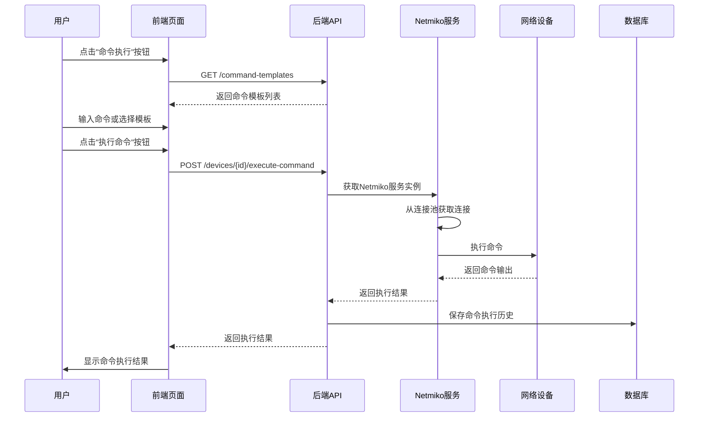
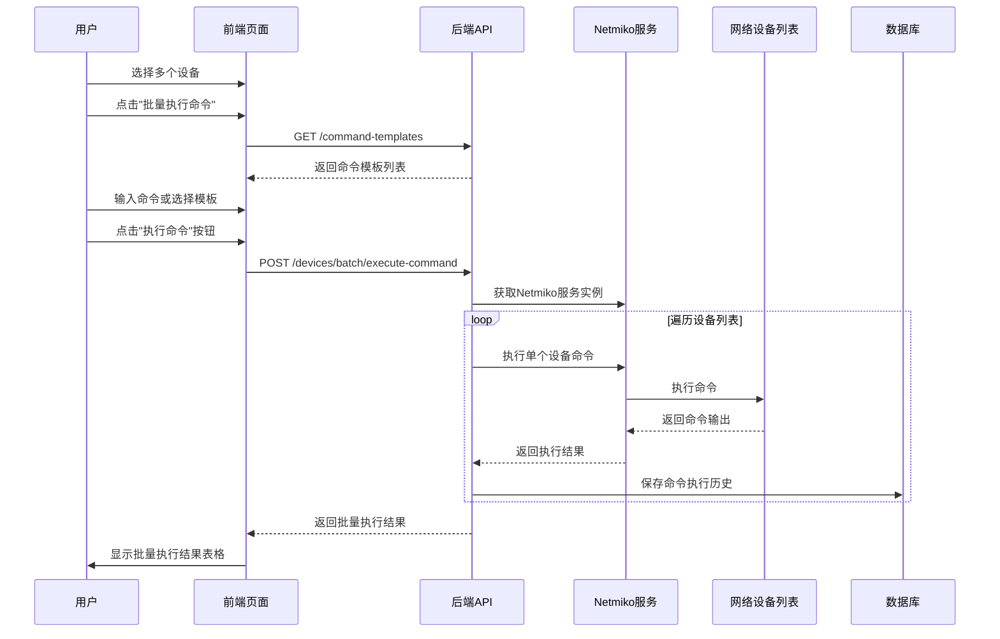
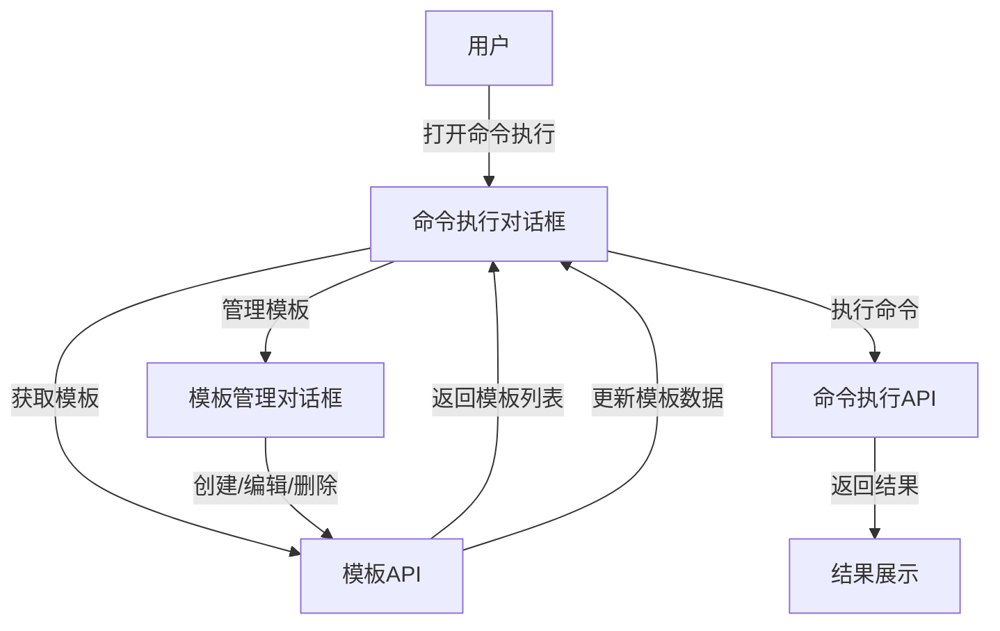

# 设备管理页面"单个/批量命令执行"功能分析报告

## 1. 功能概述

设备管理页面中的"单个/批量命令执行"功能允许用户对单台或多台交换机设备执行命令，并查看执行结果。该功能支持命令模板、历史记录和实时输出展示，提高了网络设备管理的效率和灵活性。

## 2. 前端实现分析

### 2.1 核心组件结构

在 `frontend/src/views/DeviceManagement.vue` 中，命令执行功能主要由以下组件构成：

- **命令执行对话框**：用于输入命令、选择模板和执行命令
- **命令结果对话框**：显示单个设备的命令执行结果
- **批量命令结果对话框**：以表格形式展示多台设备的命令执行结果

### 2.2 关键功能实现

1. **命令执行触发**：
   - 单个设备：通过设备列表中的"命令执行"按钮触发
   - 批量设备：通过顶部"批量操作"菜单中的"批量执行命令"选项触发

2. **命令模板支持**：
   - 从后端获取命令模板列表
   - 支持模板变量替换
   - 动态生成变量输入表单

3. **命令历史管理**：
   - 保存到localStorage，最多保留20条记录
   - 支持上下箭头浏览历史命令
   - 支持命令历史下拉选择

4. **命令执行流程**：
   - 收集命令和模板变量
   - 调用API执行命令
   - 处理执行结果
   - 显示执行结果对话框

## 3. 前后端数据交互

### 3.1 API封装

在 `frontend/src/api/index.js` 中，命令执行相关的API封装如下：

```javascript
// 执行单个设备命令
executeCommand: (id, command, variables = {}, templateId = null) => 
  api.post(`/devices/${id}/execute-command`, { command, variables, template_id: templateId }),

// 批量执行设备命令
batchExecuteCommand: (ids, command, variables = {}, templateId = null) => 
  api.post('/devices/batch/execute-command', { device_ids: ids, command, variables, template_id: templateId })
```

### 3.2 数据交互流程

1. **单个设备命令执行**：
   - 前端发送POST请求到 `/devices/{id}/execute-command`
   - 后端执行命令并返回结果
   - 前端显示执行结果对话框

2. **批量设备命令执行**：
   - 前端发送POST请求到 `/devices/batch/execute-command`
   - 后端批量执行命令并返回结果列表
   - 前端显示批量执行结果表格

## 4. 后端实现分析

### 4.1 API端点实现

在 `app/api/endpoints/devices.py` 中，命令执行相关的API端点如下：

1. **单个设备命令执行**：
   ```python
   @router.post("/{device_id}/execute-command")
   async def execute_command(device_id: int, command_request: CommandExecutionRequest, db: Session = Depends(get_db)):
       # 实现命令执行逻辑
   ```

2. **批量设备命令执行**：
   ```python
   @router.post("/batch/execute-command")
   async def batch_execute_command(batch_request: BatchCommandExecutionRequest, db: Session = Depends(get_db)):
       # 实现批量命令执行逻辑
   ```

### 4.2 核心业务逻辑

1. **命令模板变量替换**：
   ```python
   # 如果使用模板，获取模板并替换变量
   if template_id:
       template = db.query(CommandTemplate).filter(CommandTemplate.id == template_id).first()
       if template:
           # 简单的变量替换
           for var_name, var_value in variables.items():
               command = command.replace(f"{{{{{var_name}}}}}", str(var_value))
   ```

2. **命令执行与历史记录**：
   - 调用Netmiko服务执行命令
   - 记录命令执行历史到数据库
   - 返回执行结果和状态

## 5. 不同品牌设备的命令执行实现

### 5.1 Netmiko服务设计

在 `app/services/netmiko_service.py` 中，`NetmikoService` 类实现了对不同品牌设备的命令执行支持：

1. **设备类型映射**：
   ```python
   DEVICE_TYPE_MAPPING = {
       "cisco": "cisco_ios",
       "huawei": "huawei",
       "华为": "huawei",  # 支持中文厂商名称
       "h3c": "hp_comware",
       "华三": "hp_comware",
       "ruijie": "ruijie_os",
       "锐捷": "ruijie_os",
       "中兴": "huawei",
       "zte": "huawei",
   }
   ```

2. **命令映射**：
   ```python
   COMMAND_MAPPING = {
       "cisco": {
           "version": "show version",
           "interfaces": "show interfaces",
           # 其他命令...
       },
       "huawei": {
           "version": "display version",
           "interfaces": "display interface",
           # 其他命令...
       },
       # 其他厂商命令...
   }
   ```

### 5.2 命令执行机制

1. **设备连接**：
   - 根据设备厂商获取对应的Netmiko设备类型
   - 使用ConnectHandler建立SSH/Telnet连接
   - 支持密码和密钥认证

2. **命令执行**：
   ```python
   async def execute_command(self, device: Device, command: str, expect_string: Optional[str] = None, read_timeout: int = 20) -> Optional[str]:
       # 从连接池获取连接或创建新连接
       # 执行命令
       # 返回命令输出
   ```

3. **连接池管理**：
   - 使用 `SSHConnectionPool` 管理设备连接
   - 支持连接复用和自动清理
   - 提高批量命令执行效率

## 6. SSH连接池管理

在 `app/services/ssh_connection_pool.py` 中，`SSHConnectionPool` 类实现了高效的SSH连接管理：

1. **连接池核心功能**：
   - 连接创建、获取和释放
   - 连接过期检测和自动清理
   - 连接状态监控和统计

2. **连接生命周期管理**：
   - 连接创建后添加到连接池
   - 连接使用后更新最后使用时间
   - 定期清理过期连接（默认5分钟）
   - 支持手动关闭连接

3. **性能优化**：
   - 减少连接建立和关闭的开销
   - 提高批量命令执行效率
   - 限制单设备最大连接数（默认10）

## 7. 完整命令执行流程

### 7.1 单个设备命令执行流程



### 7.2 批量设备命令执行流程



## 8. 技术亮点与设计思路

1. **模块化设计**：
   - 前后端分离，职责清晰
   - 服务层封装，提高代码复用性
   - 组件化设计，便于维护和扩展

2. **性能优化**：
   - 使用连接池管理设备连接
   - 异步API设计，提高并发处理能力
   - 命令模板缓存，减少重复请求

3. **用户体验优化**：
   - 实时命令输出展示
   - 命令历史记录
   - 模板变量智能替换
   - 批量执行结果可视化

4. **多厂商支持**：
   - 设备类型自动映射
   - 命令自动适配
   - 支持中文厂商名称

5. **安全性考虑**：
   - 命令执行权限控制
   - 连接超时和错误处理
   - 命令执行历史审计

## 9. 命令模板全生命周期管理设计评估

### 9.1 需求概述

新增命令模板全生命周期管理功能，要求前端支持命令模板的创建、修改、删除等操作，完善现有的命令执行功能。

### 9.2 现有技术框架分析

#### 9.2.1 前端技术栈
- **框架**：Vue 3 + Element Plus
- **状态管理**：Pinia
- **API通信**：Axios
- **组件结构**：
  - `DeviceManagement.vue`：设备管理主页面，包含命令执行功能
  - 命令执行对话框：用于输入命令和选择模板
  - 命令结果对话框：显示执行结果

#### 9.2.2 现有API支持

已存在完整的命令模板API端点（frontend/src/api/index.js:42-47）：
- `getCommandTemplates`：获取命令模板列表
- `getCommandTemplate`：获取单个命令模板
- `createCommandTemplate`：创建命令模板
- `updateCommandTemplate`：更新命令模板
- `deleteCommandTemplate`：删除命令模板

#### 9.2.3 现有命令模板使用流程
1. 从后端获取命令模板列表
2. 支持模板选择和变量替换
3. 动态生成变量输入表单
4. 执行命令时使用模板

### 9.3 系统架构设计

#### 9.3.1 组件设计

| 组件 | 功能 | 实现方式 |
|------|------|----------|
| 命令模板管理对话框 | 模板创建、编辑、删除 | Element Plus Dialog + Form |
| 命令模板列表页 | 模板查询、展示、操作 | 独立页面或内嵌表格 |
| 命令执行对话框 | 集成模板选择和管理入口 | 现有对话框增强 |
| 模板变量配置组件 | 动态生成变量输入表单 | 可复用组件 |

#### 9.3.2 数据流设计



### 9.4 解决方案设计

#### 方案：集成在命令执行对话框中

**实现思路**：
- 在命令执行对话框中添加模板管理标签页
- 标签页包含模板列表、创建、编辑、删除功能
- 模板管理与命令执行在同一对话框中完成

**技术实现**：
```vue
<!-- 命令执行对话框增强 -->
<el-tabs v-model="activeTab" @tab-change="handleTabChange">
  <el-tab-pane label="执行命令" name="execute">
    <!-- 现有命令执行表单 -->
  </el-tab-pane>
  <el-tab-pane label="模板管理" name="templates">
    <!-- 模板管理功能 -->
  </el-tab-pane>
</el-tabs>
```

**优势**：
- 无需新增页面，开发工作量小
- 模板管理与命令执行紧密集成
- 减少用户页面切换
- 与现有功能无缝衔接
- 学习成本低，用户无需适应新界面

**劣势**：
- 对话框内容复杂，需要合理设计布局
- 功能扩展性需要精心规划
- 需注意性能优化，避免对话框加载过慢

**复杂度**：低
**性能影响**：中
**维护性**：中

### 9.5 方案选择

**选择结果**：集成在命令执行对话框中的标签页方案

**选择理由**：
1. 开发工作量最小，可快速实现
2. 模板管理与命令执行功能紧密相关，集成度高
3. 用户无需在多个页面间切换，操作流畅
4. 与现有系统架构保持一致
5. 学习成本低，用户容易适应
6. 适合当前系统规模和需求

### 9.6 详细实现方案

#### 9.6.1 前端组件设计

1. **命令执行对话框增强**
   - 集成标签页布局，包含"执行命令"和"模板管理"两个标签
   - 优化模板选择UI，支持快速切换到模板管理
   - 保持现有命令执行流程不变

2. **模板管理标签页**
   - 模板列表展示（支持搜索、过滤）
   - 模板创建表单（内嵌对话框）
   - 模板编辑表单（内嵌对话框）
   - 模板删除确认
   - 模板变量配置组件
   - 模板分类和排序功能

3. **模板变量配置组件**
   - 动态生成变量输入表单
   - 支持多种变量类型（字符串、数字、枚举等）
   - 变量验证规则配置
   - 变量描述和示例说明

#### 9.6.2 状态管理设计

```javascript
// 新增模板管理状态
const useTemplateStore = defineStore('template', {
  state: () => ({
    templates: [],
    loading: false,
    currentTemplate: null
  }),
  actions: {
    async fetchTemplates(params) {
      this.loading = true
      try {
        const result = await deviceApi.getCommandTemplates(params)
        this.templates = result.templates || []
      } catch (error) {
        console.error('加载模板失败:', error)
      } finally {
        this.loading = false
      }
    },
    async createTemplate(data) {
      try {
        const result = await deviceApi.createCommandTemplate(data)
        return result
      } catch (error) {
        console.error('创建模板失败:', error)
        throw error
      }
    },
    async updateTemplate(id, data) {
      try {
        const result = await deviceApi.updateCommandTemplate(id, data)
        return result
      } catch (error) {
        console.error('更新模板失败:', error)
        throw error
      }
    },
    async deleteTemplate(id) {
      try {
        const result = await deviceApi.deleteCommandTemplate(id)
        return result
      } catch (error) {
        console.error('删除模板失败:', error)
        throw error
      }
    }
  }
})
```

#### 9.6.3 数据验证设计

| 字段 | 验证规则 | 错误提示 |
|------|----------|----------|
| 模板名称 | 必填，唯一 | 请输入模板名称 |
| 命令内容 | 必填 | 请输入命令内容 |
| 厂商 | 可选 | - |
| 变量定义 | 语法验证 | 变量定义格式错误 |

#### 9.6.4 API调用设计

| 场景 | API | 方法 | 参数 |
|------|-----|------|------|
| 获取模板列表 | /command-templates | GET | params |
| 创建模板 | /command-templates | POST | templateData |
| 更新模板 | /command-templates/:id | PUT | templateData |
| 删除模板 | /command-templates/:id | DELETE | - |

### 9.7 系统集成与边界设计

#### 9.7.1 与现有系统的集成

1. **命令执行功能集成**
   - 模板管理更新后自动刷新模板列表
   - 保持现有命令执行流程不变
   - 增强模板选择功能

2. **权限管理集成**
   - 模板管理功能需要相应权限
   - 基于现有权限系统扩展

3. **数据一致性保障**
   - 模板更新后立即生效
   - 删除模板前检查使用情况
   - 执行命令时验证模板有效性

#### 9.7.2 边界条件处理

1. **模板变量处理**
   - 支持多种变量类型
   - 变量默认值设置
   - 变量描述和验证规则

2. **错误处理**
   - API调用错误提示
   - 表单验证错误提示
   - 操作失败回滚

3. **性能优化**
   - 模板列表分页
   - 模板数据缓存
   - 异步API调用

### 9.8 部署与测试策略

#### 9.8.1 部署策略
- 前端资源打包部署
- 与现有系统无缝集成
- 无需后端额外部署

#### 9.8.2 测试策略

| 测试类型 | 测试内容 | 测试方法 |
|----------|----------|----------|
| 功能测试 | 模板创建、编辑、删除 | 手动测试 + 自动化测试 |
| 集成测试 | 与命令执行功能集成 | 端到端测试 |
| 性能测试 | 模板列表加载、操作响应 | 性能测试工具 |
| 兼容性测试 | 不同浏览器、设备 | 多浏览器测试 |
| 安全测试 | 权限控制、数据验证 | 安全测试工具 |

### 9.9 实施计划

| 阶段 | 任务 | 时间 | 负责人 |
|------|------|------|--------|
| 需求分析 | 需求确认、技术方案评审 | 2天 | 产品、开发 |
| 设计阶段 | UI设计、详细设计 | 3天 | 设计、开发 |
| 开发阶段 | 组件开发、功能实现 | 5天 | 开发 |
| 测试阶段 | 功能测试、集成测试、性能测试 | 3天 | 测试、开发 |
| 上线阶段 | 部署、灰度发布、监控 | 2天 | 运维、开发 |
| 总计 | - | 15天 | - |

### 9.10 风险评估

| 风险 | 影响 | 缓解措施 |
|------|------|----------|
| 模板变量复杂度过高 | 影响用户体验 | 提供变量配置向导、示例模板 |
| 模板数量过多导致性能问题 | 页面加载缓慢 | 实现分页、搜索、缓存机制 |
| 模板权限管理不当 | 安全风险 | 严格的权限控制、操作审计 |
| 与现有系统集成问题 | 功能异常 | 充分的集成测试、灰度发布 |

### 9.11 后续扩展规划

1. **模板分类管理**：支持模板按功能、厂商分类
2. **模板版本控制**：记录模板变更历史，支持回滚
3. **模板共享机制**：支持模板共享和权限控制
4. **智能模板推荐**：根据设备类型、历史使用推荐模板
5. **模板导入导出**：支持批量模板导入导出

## 10. 总结

设备管理页面中的"单个/批量命令执行"功能是交换机批量管理与巡检系统的核心功能之一。通过添加命令模板全生命周期管理功能，进一步提高了系统的易用性和灵活性。

设计上采用了在命令执行对话框中集成标签页的方案，实现了模板管理与命令执行功能的紧密结合。该方案开发工作量小，用户体验流畅，与现有系统无缝集成，保持了系统架构的一致性和完整性。

通过实施该方案，网络运维人员可以在同一对话框内完成命令执行和模板管理的所有操作，减少了页面切换，提高了工作效率。同时，该方案具有良好的可维护性和扩展性，能够适应未来系统功能的扩展需求。

该设计充分考虑了系统的实际使用场景和用户需求，通过合理的UI设计和功能布局，为网络运维人员提供了更加高效、便捷的设备管理工具，有助于提高网络设备管理的效率和可靠性。