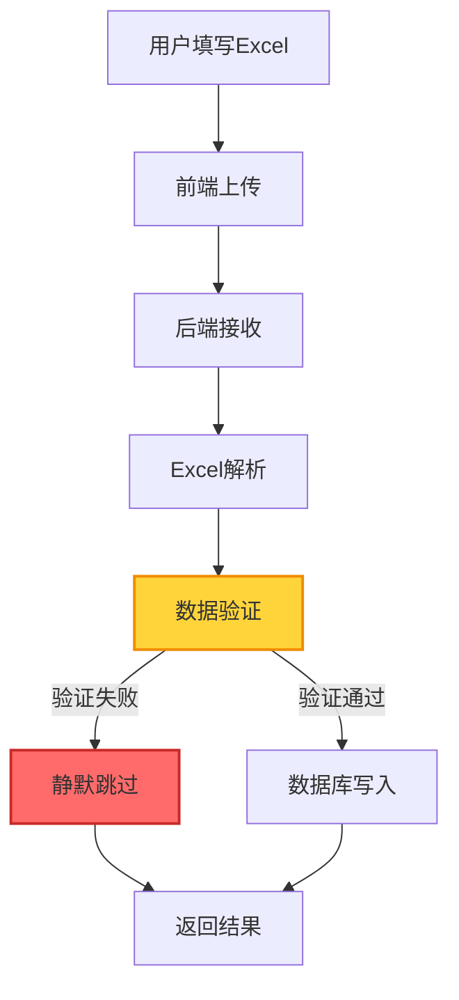
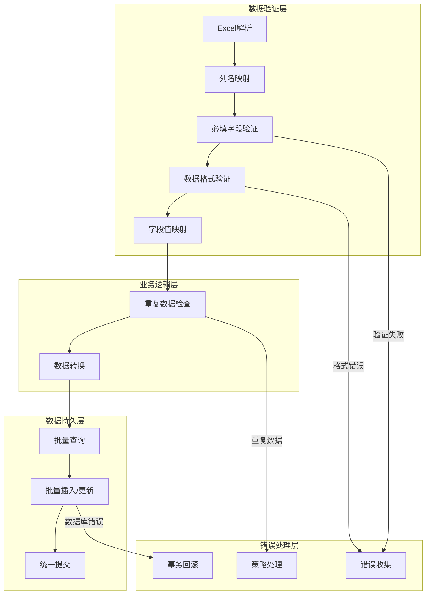
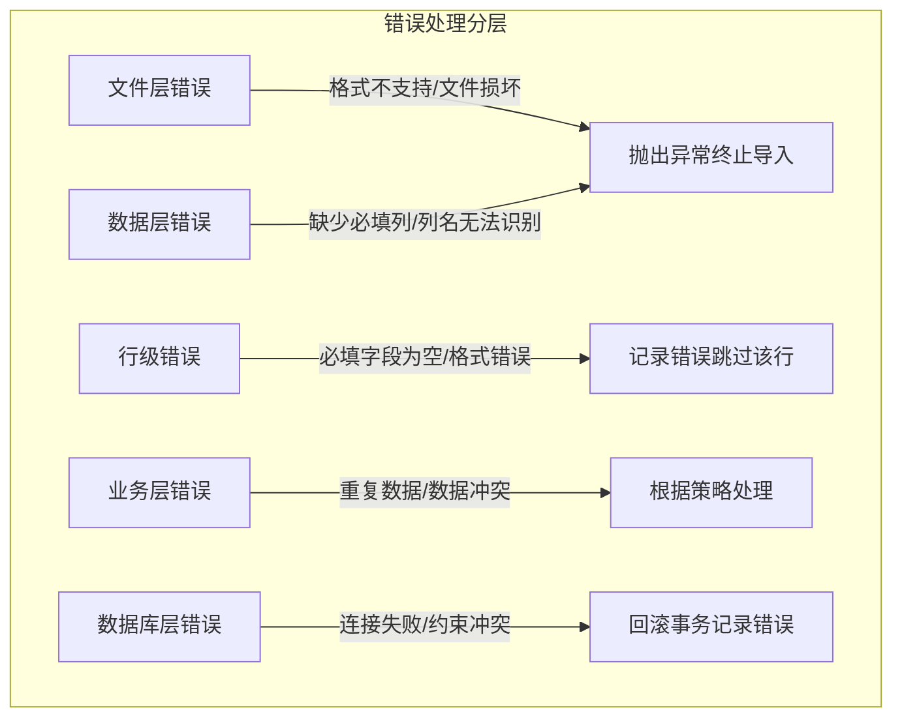

# 批量上传设备功能失效 - 优化修复方案 v2

> 分析日期：2026-02-05
> 问题描述：前端页面显示"批量导入完成:0成功,0跳过,0失败"，但实际上传的Excel包含资产信息
> 优化版本：基于评审文档 v1 的改进方案

---

## 1. 问题概述

### 1.1 现象描述
- 用户下载设备模板并填写资产信息后上传
- 点击"确认上传"后，前端显示"批量导入完成:0成功,0跳过,0失败"
- 设备列表中未出现新导入的设备
- 后端API返回200 OK，没有报错信息

### 1.2 影响范围
- 设备管理页面的批量上传功能完全失效
- 用户无法通过Excel批量导入设备数据

---

## 2. 根因分析

### 2.1 数据流分析



### 2.2 核心问题定位

#### 问题1：必填字段验证失败时静默跳过（**主要原因**）

**问题代码位置**: `app/services/excel_service.py` 第93-97行

```python
# 验证必填字段不为空
valid_devices = []
for idx, row in df.iterrows():
    # 检查必填字段
    if pd.isna(row['hostname']) or pd.isna(row['ip_address']) or \
       pd.isna(row['vendor']) or pd.isna(row['model']):
        continue  # ❌ 直接跳过，没有记录错误
```

**问题分析**:
- 当Excel中的必填字段（hostname, ip_address, vendor, model）为空或格式不正确时
- 代码使用`continue`直接跳过该行数据
- **没有记录错误信息，也没有增加失败计数**
- 导致用户看到的永远是"0成功,0跳过,0失败"

#### 问题2：状态字段值映射缺失

**前端定义** (`frontend/src/views/DeviceManagement.vue` 第9-14行):
```javascript
const statusOptions = [
  { label: '活跃', value: 'active' },
  { label: '维护', value: 'maintenance' },
  { label: '离线', value: 'offline' },
  { label: '故障', value: 'faulty' }
]
```

**后端处理** (`app/services/excel_service.py` 第108行):
```python
'status': str(row.get('status', 'active')).strip() if pd.notna(row.get('status')) else 'active',
```

**问题分析**:
- 用户下载的模板中，状态字段可能是中文（如"活跃"）
- 后端直接将中文状态值存入数据库
- 但数据库可能期望的是英文枚举值（如"active"）
- 缺少中文到英文的状态值映射转换

#### 问题3：厂商字段值映射缺失

**前端定义** (`frontend/src/views/DeviceManagement.vue` 第17-23行):
```javascript
const vendorOptions = [
  { label: '华为', value: 'Huawei' },
  { label: '思科', value: 'Cisco' },
  { label: '华三', value: 'H3C' },
  { label: '锐捷', value: 'Ruijie' },
  { label: '中兴', value: 'ZTE' }
]
```

**后端处理** (`app/services/excel_service.py` 第103行):
```python
'vendor': str(row['vendor']).strip(),
```

**问题分析**:
- 用户下载的模板中，厂商字段可能是中文（如"华为"）
- 后端直接将中文厂商名存入数据库
- 但数据库期望的是英文厂商名（如"Huawei"）
- 缺少中文到英文的厂商名映射转换

#### 问题4：模板下载与上传的数据格式不一致

**模板生成** (`app/services/excel_service.py` 第223-291行):
```python
def generate_device_template(session: Session = None) -> BytesIO:
    device_fields = [
        'hostname', 'ip_address', 'vendor', 'model', 'os_version', 
        'location', 'contact', 'status', 'login_method', 'login_port', 
        'username', 'password', 'sn'
    ]
    # 直接使用英文字段名作为表头
```

**问题分析**:
- 模板下载时使用的是英文字段名
- 但用户可能期望看到中文表头
- 用户填写中文值后，后端无法正确解析

#### 问题5：IP地址格式验证缺失（评审新增）

**问题分析**:
- 修复方案未包含IP地址格式验证
- 用户可能输入无效的IP地址
- 可能导致数据库写入失败或数据不一致

#### 问题6：事务一致性问题（评审新增）

**问题分析**:
- 当前代码每个设备单独commit
- 如果部分设备导入失败，已提交的数据无法回滚
- 可能导致数据不一致

---

## 3. 优化修复方案

### 3.1 整体架构设计



### 3.2 修复方案一：完善数据验证和错误报告（P0优先级）

#### 3.2.1 重构 `validate_device_data` 函数

**修改文件**: `app/services/excel_service.py`

```python
import ipaddress
from typing import Tuple

def validate_device_data(df: pd.DataFrame) -> Tuple[List[Dict[str, Any]], List[str]]:
    """
    验证并转换设备数据
    
    Returns:
        Tuple[valid_devices, validation_errors]: 验证通过的设备列表和验证错误列表
    """
    # 定义必填字段
    required_columns = ['hostname', 'ip_address', 'vendor', 'model']
    
    # 定义字段映射（支持中文列名）
    column_mapping = {
        '主机名': 'hostname',
        '设备名称': 'hostname',
        '名称': 'hostname',
        'IP地址': 'ip_address',
        'IP': 'ip_address',
        'IP Address': 'ip_address',
        '厂商': 'vendor',
        '供应商': 'vendor',
        '厂商品牌': 'vendor',
        '型号': 'model',
        '设备型号': 'model',
        'Model': 'model',
        '位置': 'location',
        '机房位置': 'location',
        'Location': 'location',
        '联系人': 'contact',
        '联系方式': 'contact',
        'Contact': 'contact',
        '状态': 'status',
        'Status': 'status',
        '操作系统版本': 'os_version',
        'OS版本': 'os_version',
        'OS Version': 'os_version',
        '登录方式': 'login_method',
        '连接方式': 'login_method',
        'Login Method': 'login_method',
        '登录端口': 'login_port',
        '连接端口': 'login_port',
        'Login Port': 'login_port',
        '用户名': 'username',
        '账号': 'username',
        'Username': 'username',
        '密码': 'password',
        'Password': 'password',
        '序列号': 'sn',
        'SN': 'sn',
        'Serial Number': 'sn',
    }
    
    # 状态值映射（中文 -> 英文）
    status_mapping = {
        '活跃': 'active',
        '维护': 'maintenance',
        '离线': 'offline',
        '故障': 'faulty',
        'active': 'active',
        'maintenance': 'maintenance',
        'offline': 'offline',
        'faulty': 'faulty',
    }
    
    # 厂商值映射（中文 -> 英文）
    vendor_mapping = {
        '华为': 'Huawei',
        '思科': 'Cisco',
        '华三': 'H3C',
        '锐捷': 'Ruijie',
        '中兴': 'ZTE',
        'Huawei': 'Huawei',
        'Cisco': 'Cisco',
        'H3C': 'H3C',
        'Ruijie': 'Ruijie',
        'ZTE': 'ZTE',
    }
    
    # 尝试映射中文列名
    for cn_col, en_col in column_mapping.items():
        if cn_col in df.columns and en_col not in df.columns:
            df.rename(columns={cn_col: en_col}, inplace=True)
    
    # 检查必填列是否存在
    missing_columns = [col for col in required_columns if col not in df.columns]
    if missing_columns:
        raise ValueError(f"缺少必填列: {', '.join(missing_columns)}")
    
    # 验证设备数据
    valid_devices = []
    validation_errors = []
    
    for idx, row in df.iterrows():
        row_num = idx + 2  # Excel行号（考虑表头）
        
        # 检查必填字段
        missing_fields = []
        if pd.isna(row['hostname']) or str(row['hostname']).strip() == '':
            missing_fields.append('主机名')
        if pd.isna(row['ip_address']) or str(row['ip_address']).strip() == '':
            missing_fields.append('IP地址')
        if pd.isna(row['vendor']) or str(row['vendor']).strip() == '':
            missing_fields.append('厂商')
        if pd.isna(row['model']) or str(row['model']).strip() == '':
            missing_fields.append('型号')
        
        if missing_fields:
            validation_errors.append(f"第{row_num}行: 缺少必填字段 - {', '.join(missing_fields)}")
            continue
        
        # IP地址格式验证
        ip_address = str(row['ip_address']).strip()
        try:
            ipaddress.ip_address(ip_address)
        except ValueError:
            validation_errors.append(f"第{row_num}行: IP地址格式无效 - {ip_address}")
            continue
        
        # 转换状态值
        status = str(row.get('status', 'active')).strip() if pd.notna(row.get('status')) else 'active'
        status = status_mapping.get(status, status)  # 中文转英文
        
        # 转换厂商值
        vendor = str(row['vendor']).strip()
        vendor = vendor_mapping.get(vendor, vendor)  # 中文转英文
        
        # 转换为设备数据字典
        device_data = {
            'hostname': str(row['hostname']).strip(),
            'ip_address': ip_address,
            'vendor': vendor,
            'model': str(row['model']).strip(),
            'os_version': str(row.get('os_version', '')).strip() if pd.notna(row.get('os_version')) else '',
            'location': str(row.get('location', '')).strip() if pd.notna(row.get('location')) else '',
            'contact': str(row.get('contact', '')).strip() if pd.notna(row.get('contact')) else '',
            'status': status,
            'login_method': str(row.get('login_method', 'ssh')).strip().lower() if pd.notna(row.get('login_method')) else 'ssh',
            'login_port': int(row.get('login_port', 22)) if pd.notna(row.get('login_port')) else 22,
            'username': str(row.get('username', '')).strip() if pd.notna(row.get('username')) else '',
            'password': str(row.get('password', '')).strip() if pd.notna(row.get('password')) else '',
            'sn': str(row.get('sn', '')).strip() if pd.notna(row.get('sn')) else '',
        }
        
        # 验证登录方式
        if device_data['login_method'] not in ['ssh', 'telnet', 'console']:
            device_data['login_method'] = 'ssh'
        
        # 验证登录端口范围
        if device_data['login_port'] < 1 or device_data['login_port'] > 65535:
            device_data['login_port'] = 22
        
        # 如果是telnet且端口为22，自动改为23
        if device_data['login_method'] == 'telnet' and device_data['login_port'] == 22:
            device_data['login_port'] = 23
        
        valid_devices.append(device_data)
    
    return valid_devices, validation_errors
```

#### 3.2.2 重构 `import_devices_from_excel` 函数（含事务一致性优化）

```python
def import_devices_from_excel(file_content: BinaryIO, session: Session, 
                              skip_existing: bool = False) -> Dict[str, Any]:
    """
    从Excel文件导入设备数据到数据库
    
    Args:
        file_content: Excel文件内容的二进制流
        session: SQLAlchemy会话
        skip_existing: 是否跳过已存在的设备（根据ip_address判断）
    
    Returns:
        导入结果统计字典
    """
    stats = {
        'total': 0,
        'success': 0,
        'skipped': 0,
        'failed': 0,
        'errors': []
    }
    
    try:
        # 读取Excel文件
        df = read_excel_file(file_content)
        stats['total'] = len(df)
        
        # 验证设备数据（返回数据和错误列表）
        valid_devices, validation_errors = validate_device_data(df)
        stats['errors'].extend(validation_errors)
        stats['failed'] = len(validation_errors)
        
        if not valid_devices:
            return stats
        
        # 批量查询已存在的设备（优化N+1问题）
        existing_ips = {
            d.ip_address for d in session.query(Device.ip_address).filter(
                Device.ip_address.in_([d['ip_address'] for d in valid_devices])
            ).all()
        }
        
        # 分离新设备和需要更新的设备
        new_devices = []
        devices_to_update = []
        
        for device_data in valid_devices:
            if device_data['ip_address'] in existing_ips:
                if skip_existing:
                    stats['skipped'] += 1
                    stats['errors'].append(
                        f"设备 {device_data['hostname']} (IP: {device_data['ip_address']}) 已存在，已跳过"
                    )
                else:
                    devices_to_update.append(device_data)
            else:
                new_devices.append(device_data)
        
        # 批量插入新设备
        if new_devices:
            try:
                session.bulk_insert_mappings(Device, new_devices)
                stats['success'] += len(new_devices)
            except Exception as e:
                error_msg = f"批量插入新设备失败: {str(e)}"
                stats['errors'].append(error_msg)
                stats['failed'] += len(new_devices)
                new_devices = []  # 标记为失败
        
        # 批量更新现有设备
        import_errors = []
        for device_data in devices_to_update:
            try:
                existing = session.query(Device).filter(
                    Device.ip_address == device_data['ip_address']
                ).first()
                
                if existing:
                    # 记录更新的字段
                    updated_fields = []
                    for key, value in device_data.items():
                        if key != 'ip_address' and key != 'password':  # IP地址和密码不自动更新
                            old_value = getattr(existing, key)
                            if old_value != value:
                                setattr(existing, key, value)
                                updated_fields.append(key)
                    
                    if updated_fields:
                        stats['success'] += 1
                        stats['errors'].append(
                            f"设备 {device_data['hostname']} 已更新字段: {', '.join(updated_fields)}"
                        )
                    else:
                        stats['skipped'] += 1
                        stats['errors'].append(
                            f"设备 {device_data['hostname']} 无变化，已跳过"
                        )
            except Exception as e:
                import_errors.append(
                    f"{device_data['hostname']} ({device_data['ip_address']}): {str(e)}"
                )
        
        # 统一提交事务
        try:
            session.commit()
        except Exception as e:
            session.rollback()
            stats['errors'].append(f"事务提交失败: {str(e)}")
            stats['failed'] += len(new_devices) + len(devices_to_update)
            stats['success'] = 0
            return stats
        
        # 合并导入错误
        stats['errors'].extend(import_errors)
        stats['failed'] += len(import_errors)
        
    except Exception as e:
        stats['errors'].append(str(e))
        stats['failed'] = stats['total']
    
    return stats
```

### 3.3 修复方案二：优化模板下载（P1优先级）

#### 3.3.1 生成带中文表头的模板

```python
def generate_device_template(session: Session = None) -> BytesIO:
    """
    生成设备导入模板（带中文表头和示例数据）
    
    Args:
        session: SQLAlchemy会话，如果提供则包含现有设备数据
    
    Returns:
        包含模板数据的BytesIO对象
    """
    # 定义字段映射（英文 -> 中文）
    field_headers = {
        'hostname': '主机名*',
        'ip_address': 'IP地址*',
        'vendor': '厂商*',
        'model': '型号*',
        'os_version': '操作系统版本',
        'location': '位置',
        'contact': '联系人',
        'status': '状态',
        'login_method': '登录方式',
        'login_port': '登录端口',
        'username': '用户名',
        'password': '密码',
        'sn': '序列号',
    }
    
    # 创建示例数据（帮助用户理解填写格式）
    example_data = [
        {
            'hostname': 'SW-Core-01',
            'ip_address': '192.168.1.1',
            'vendor': '华为',
            'model': 'S5735S-L48T4S-A',
            'os_version': 'V200R019C10SPC500',
            'location': '机房A',
            'contact': '张三',
            'status': '活跃',
            'login_method': 'ssh',
            'login_port': 22,
            'username': 'admin',
            'password': 'password123',
            'sn': '210235448610F3001234',
        },
        {
            'hostname': 'SW-Core-02',
            'ip_address': '192.168.1.2',
            'vendor': '思科',
            'model': 'Catalyst 9300',
            'os_version': '17.9.4',
            'location': '机房B',
            'contact': '李四',
            'status': '维护',
            'login_method': 'telnet',
            'login_port': 23,
            'username': 'admin',
            'password': 'cisco123',
            'sn': 'FCW1234L567',
        }
    ]
    
    # 创建Excel文件
    from openpyxl import Workbook
    from openpyxl.styles import Font, PatternFill, Alignment, Border, Side
    
    wb = Workbook()
    ws = wb.active
    ws.title = "设备清单"
    
    # 写入表头（中文）
    headers = list(field_headers.values())
    ws.append(headers)
    
    # 设置表头样式
    header_fill = PatternFill(start_color="4472C4", end_color="4472C4", fill_type="solid")
    header_font = Font(bold=True, color="FFFFFF")
    header_alignment = Alignment(horizontal="center", vertical="center")
    
    for cell in ws[1]:
        cell.fill = header_fill
        cell.font = header_font
        cell.alignment = header_alignment
    
    # 写入示例数据
    for row_data in example_data:
        row = [row_data.get(field, '') for field in field_headers.keys()]
        ws.append(row)
    
    # 设置列宽
    column_widths = {
        'A': 20,  # hostname
        'B': 15,  # ip_address
        'C': 12,  # vendor
        'D': 25,  # model
        'E': 25,  # os_version
        'F': 20,  # location
        'G': 15,  # contact
        'H': 12,  # status
        'I': 12,  # login_method
        'J': 12,  # login_port
        'K': 15,  # username
        'L': 15,  # password
        'M': 25,  # sn
    }
    
    for col, width in column_widths.items():
        ws.column_dimensions[col].width = width
    
    # 添加说明工作表
    ws_help = wb.create_sheet("填写说明")
    help_content = [
        ["字段名称", "说明", "必填", "示例值"],
        ["主机名", "设备的主机名", "是", "SW-Core-01"],
        ["IP地址", "设备的IP地址", "是", "192.168.1.1"],
        ["厂商", "设备厂商（支持中文）", "是", "华为、思科、华三、锐捷、中兴"],
        ["型号", "设备型号", "是", "S5735S-L48T4S-A"],
        ["操作系统版本", "设备的OS版本", "否", "V200R019C10SPC500"],
        ["位置", "设备所在位置", "否", "机房A"],
        ["联系人", "设备负责人", "否", "张三"],
        ["状态", "设备状态", "否", "活跃、维护、离线、故障"],
        ["登录方式", "SSH/Telnet/Console", "否", "ssh"],
        ["登录端口", "登录端口号", "否", "22"],
        ["用户名", "登录用户名", "否", "admin"],
        ["密码", "登录密码（建议导入后修改）", "否", "password123"],
        ["序列号", "设备序列号", "否", "210235448610F3001234"],
    ]
    
    for row in help_content:
        ws_help.append(row)
    
    # 设置说明表样式
    help_fill = PatternFill(start_color="70AD47", end_color="70AD47", fill_type="solid")
    help_font = Font(bold=True, color="FFFFFF")
    
    for cell in ws_help[1]:
        cell.fill = help_fill
        cell.font = help_font
    
    # 设置说明表列宽
    ws_help.column_dimensions['A'].width = 15
    ws_help.column_dimensions['B'].width = 30
    ws_help.column_dimensions['C'].width = 10
    ws_help.column_dimensions['D'].width = 40
    
    # 保存到BytesIO对象
    output = BytesIO()
    wb.save(output)
    output.seek(0)
    
    return output
```

### 3.4 错误处理策略（分层设计）



| 层级 | 错误类型 | 处理方式 | 用户反馈 |
|------|----------|----------|----------|
| 文件层 | 格式不支持、文件损坏 | 抛出异常，终止导入 | "不支持的文件格式，请上传.xlsx文件" |
| 数据层 | 缺少必填列、列名无法识别 | 抛出异常，终止导入 | "Excel缺少必填列: hostname, ip_address" |
| 行级 | 必填字段为空、IP格式错误 | 记录错误，跳过该行 | "第3行: 缺少必填字段 - 主机名" |
| 业务层 | 重复数据、数据冲突 | 根据策略处理（跳过/更新） | "设备已存在，已跳过/已更新" |
| 数据库层 | 连接失败、约束冲突 | 回滚事务，记录错误 | "导入失败，请稍后重试" |

---

## 4. 实施计划

### 4.1 实施优先级

| 优先级 | 任务 | 说明 | 预计工时 |
|--------|------|------|----------|
| **P0** | 修复静默跳过问题 | 核心问题，必须优先解决 | 2h |
| **P0** | 添加错误报告机制 | 与静默跳过问题一起修复 | 1h |
| **P1** | 添加字段值映射 | 状态、厂商的中文映射 | 1h |
| **P1** | 添加IP地址格式验证 | 评审新增要求 | 1h |
| **P1** | 优化模板下载 | 中文表头、示例数据 | 2h |
| **P2** | 事务一致性优化 | 批量提交策略 | 2h |
| **P2** | 性能优化 | 批量查询、批量插入 | 2h |

### 4.2 分阶段实施

#### 第一阶段：核心修复（P0）
1. 修改 `validate_device_data` 函数，添加错误收集
2. 修改 `import_devices_from_excel` 函数，完善统计信息
3. 单元测试验证

#### 第二阶段：功能增强（P1）
1. 添加状态值和厂商值映射
2. 添加IP地址格式验证
3. 优化模板下载功能
4. 完善错误提示信息

#### 第三阶段：性能优化（P2）
1. 优化数据库操作（批量查询、批量插入）
2. 添加事务一致性控制
3. 大数据量导入性能测试和优化

### 4.3 回滚策略

1. 保留原始代码的备份
2. 使用特性开关控制新功能启用
3. 分环境部署（dev → test → prod）
4. 部署后监控关键指标（导入成功率、错误率）

---

## 5. 测试方案

### 5.1 单元测试场景

```python
def test_validate_device_data():
    """测试数据验证函数"""
    # 测试正常数据
    # 测试中文列名
    # 测试缺失必填字段
    # 测试空值处理
    # 测试状态值映射
    # 测试厂商值映射
    # 测试IP地址格式验证
    pass

def test_import_devices():
    """测试设备导入函数"""
    # 测试正常导入
    # 测试重复数据（跳过模式）
    # 测试重复数据（更新模式）
    # 测试部分失败
    # 测试全部失败
    # 测试事务回滚
    pass
```

### 5.2 集成测试场景

1. **端到端测试**：下载模板 → 填写数据 → 上传导入 → 验证结果
2. **大数据量测试**：测试1000+设备的导入性能
3. **并发测试**：多个用户同时导入

### 5.3 边界条件测试

| 场景 | 预期结果 |
|------|----------|
| Excel文件为空（只有表头） | 返回0成功，0失败 |
| Excel文件只有一行数据 | 正确处理 |
| 包含10000行数据 | 性能可接受（<30秒） |
| 包含特殊字符（如换行符） | 正确处理或给出明确错误 |
| IP地址格式错误 | 记录错误，跳过该行 |
| 端口号超出范围 | 自动修正为默认值 |
| 中文厂商名 | 正确映射为英文 |
| 中文状态值 | 正确映射为英文 |

---

## 6. 相关代码文件

| 文件路径 | 说明 | 修改建议 |
|----------|------|----------|
| `app/services/excel_service.py` | Excel处理服务 | 主要修改文件 |
| `app/api/endpoints/devices.py` | 设备API端点 | 可能需要调整错误处理 |
| `frontend/src/views/DeviceManagement.vue` | 设备管理页面 | 无需修改 |
| `app/models/models.py` | 数据模型 | 无需修改 |

---

## 7. 总结

### 7.1 优化要点

本方案在原有修复方案基础上，根据评审意见进行了以下优化：

1. **事务一致性**：采用统一提交策略，确保数据一致性
2. **性能优化**：使用批量查询和批量插入，解决N+1问题
3. **错误分类**：区分验证错误和导入错误，避免重复计算
4. **IP验证**：新增IP地址格式验证
5. **更新追踪**：记录更新字段，提供更详细的反馈
6. **密码保护**：更新时跳过密码字段，避免意外覆盖

### 7.2 修复优先级

1. **高优先级**: 修复`validate_device_data`函数，添加错误报告
2. **中优先级**: 添加中文到英文的字段值映射、IP验证
3. **低优先级**: 优化模板下载，添加中文表头和示例数据

### 7.3 注意事项

- 修复后需要测试各种边界情况
- 确保向后兼容（支持英文值的Excel文件）
- 更新用户文档，说明支持的字段值格式
- 考虑添加导入日志记录功能

---

*文档版本：v2.0*
*优化日期：2026-02-05*
