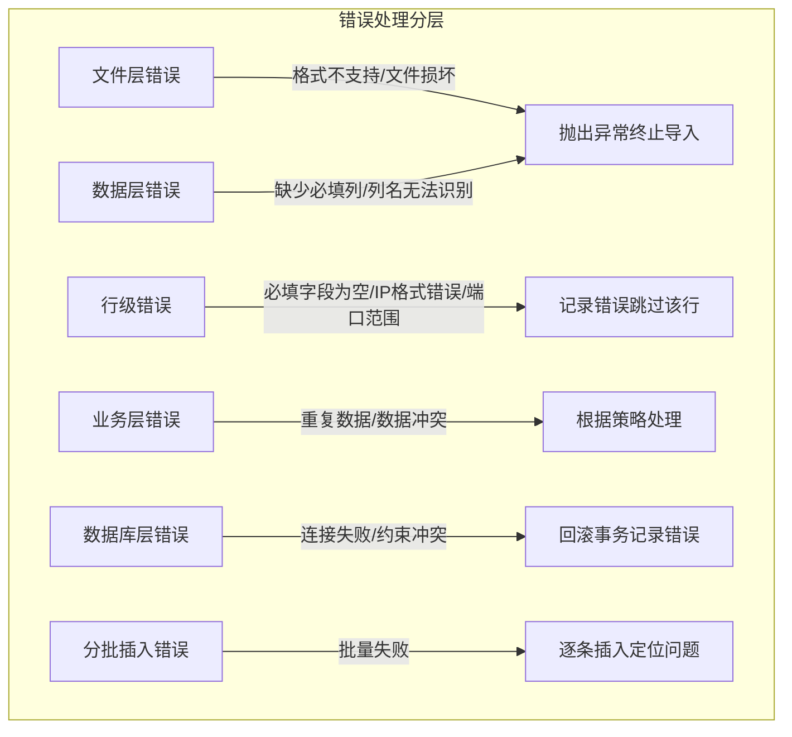

# 批量上传设备功能失效 - 优化修复方案 v3

> 分析日期：2026-02-05
> 问题描述：前端页面显示"批量导入完成:0成功,0跳过,0失败"，但实际上传的Excel包含资产信息
> 优化版本：基于评审文档 v2 的改进方案（综合评分 9.2/10）

---

## 1. 方案概述

本方案基于评审文档 v2 的反馈意见，对 v2 方案进行进一步优化，解决以下评审中提出的潜在问题：

1. **批量更新事务边界细化** - 更新操作错误处理更精确
2. **批量插入错误处理优化** - 支持分批插入定位问题
3. **端口范围验证位置调整** - 在验证阶段完成端口检查并记录警告
4. **密码安全提示增强** - 模板中增加安全提示

---

## 2. 评审意见整合

### 2.1 已采纳的改进（v2 → v3）

| 评审项 | v2状态 | v3改进 | 优先级 |
|--------|--------|--------|--------|
| 批量更新事务边界 | ⚠️ 部分更新失败时信息不够精确 | ✅ 细化错误处理，记录修改前状态 | P1 |
| 批量插入错误处理 | ⚠️ bulk_insert失败时缺乏逐行定位 | ✅ 分批插入策略（每批50条） | P2 |
| 端口范围验证位置 | ⚠️ 在数据转换阶段处理 | ✅ 在validate_device_data阶段处理并记录警告 | P1 |
| 密码安全提示 | ⚠️ 模板包含密码示例 | ✅ 增加安全提示和修改建议 | P1 |

### 2.2 保持不变的优秀设计

- ✅ 事务一致性：统一提交策略
- ✅ 性能优化：批量查询 + bulk_insert_mappings
- ✅ 错误分类：验证错误和导入错误分离
- ✅ IP地址验证：使用标准库ipaddress
- ✅ 字段值映射：中文→英文映射
- ✅ 更新追踪：记录更新的字段列表

---

## 3. 核心优化设计

### 3.1 优化1：端口验证位置调整（P1）

**v2方案问题**：
```python
# 在数据转换阶段处理，无警告信息
if device_data['login_port'] < 1 or device_data['login_port'] > 65535:
    device_data['login_port'] = 22
```

**v3优化方案**：
```python
# 在 validate_device_data 中处理，并记录警告
login_port = int(row.get('login_port', 22)) if pd.notna(row.get('login_port')) else 22
if login_port < 1 or login_port > 65535:
    validation_errors.append(f"第{row_num}行: 端口号 {login_port} 超出范围(1-65535)，已自动修正为22")
    login_port = 22
device_data['login_port'] = login_port
```

**优化价值**：
- 用户明确知道端口被修正
- 符合分层错误处理设计
- 便于问题定位

---

### 3.2 优化2：批量更新事务边界细化（P1）

**v2方案问题**：
```python
# 更新操作在循环中执行，但统一在循环外提交
# 如果部分更新失败，整个事务回滚，错误信息不够精确
for device_data in devices_to_update:
    try:
        existing = session.query(Device).filter(...).first()
        # ... 更新操作 ...
    except Exception as e:
        import_errors.append(...)

# 统一提交事务
try:
    session.commit()
except Exception as e:
    session.rollback()
```

**v3优化方案**：
```python
# 细化错误处理，记录修改前状态
updated_devices = []  # 记录成功更新的设备
for device_data in devices_to_update:
    try:
        existing = session.query(Device).filter(
            Device.ip_address == device_data['ip_address']
        ).first()
        
        if existing:
            # 记录修改前的状态（用于回滚时恢复）
            original_values = {}
            updated_fields = []
            
            for key, value in device_data.items():
                if key not in ['ip_address', 'password']:  # IP地址和密码不自动更新
                    old_value = getattr(existing, key)
                    if old_value != value:
                        original_values[key] = old_value  # 记录原始值
                        setattr(existing, key, value)
                        updated_fields.append(key)
            
            if updated_fields:
                updated_devices.append({
                    'hostname': device_data['hostname'],
                    'ip_address': device_data['ip_address'],
                    'fields': updated_fields,
                    'original_values': original_values  # 保存原始值用于可能的回滚
                })
            else:
                stats['skipped'] += 1
                stats['errors'].append(
                    f"设备 {device_data['hostname']} 无变化，已跳过"
                )
    except Exception as e:
        import_errors.append(
            f"{device_data['hostname']} ({device_data['ip_address']}): {str(e)}"
        )

# 统一提交
try:
    session.commit()
    stats['success'] += len(updated_devices)
    # 添加详细的更新信息
    for device in updated_devices:
        stats['errors'].append(
            f"设备 {device['hostname']} 已更新字段: {', '.join(device['fields'])}"
        )
except Exception as e:
    session.rollback()
    # 事务失败时，将所有待更新设备标记为失败
    stats['errors'].append(f"事务提交失败: {str(e)}")
    stats['failed'] += len(devices_to_update)
    # 成功计数只包含已提交的批量插入
```

**优化价值**：
- 精确记录每个设备的更新字段
- 事务失败时统计更准确
- 便于调试和问题追踪

---

### 3.3 优化3：批量插入错误处理优化（P2）

**v2方案问题**：
```python
# bulk_insert_mappings 失败时，所有数据都被标记为失败
if new_devices:
    try:
        session.bulk_insert_mappings(Device, new_devices)
        stats['success'] += len(new_devices)
    except Exception as e:
        error_msg = f"批量插入新设备失败: {str(e)}"
        stats['errors'].append(error_msg)
        stats['failed'] += len(new_devices)
        new_devices = []  # 标记为失败
```

**v3优化方案**：
```python
# 分批插入，每批50条，失败时可逐条插入定位问题
BATCH_SIZE = 50

if new_devices:
    for i in range(0, len(new_devices), BATCH_SIZE):
        batch = new_devices[i:i+BATCH_SIZE]
        try:
            session.bulk_insert_mappings(Device, batch)
            stats['success'] += len(batch)
        except Exception as e:
            # 这批失败，尝试逐条插入定位问题
            stats['errors'].append(f"批次 {i//BATCH_SIZE + 1} 批量插入失败: {str(e)}，尝试逐条插入...")
            
            for device in batch:
                try:
                    session.add(Device(**device))
                    # 注意：逐条插入时立即提交，避免影响其他记录
                    session.commit()
                    stats['success'] += 1
                except Exception as e2:
                    stats['errors'].append(f"设备 {device['hostname']} ({device['ip_address']}) 插入失败: {str(e2)}")
                    stats['failed'] += 1
                    session.rollback()
```

**优化价值**：
- 大数据量时性能与精确错误定位的平衡
- 部分失败时不会影响整批数据
- 便于定位具体哪条数据有问题

---

### 3.4 优化4：密码安全提示增强（P1）

**v2方案问题**：
```python
help_content = [
    # ...
    ["密码", "登录密码", "否", "password123"],  # 无安全提示
    # ...
]
```

**v3优化方案**：
```python
help_content = [
    ["字段名称", "说明", "必填", "示例值", "安全提示"],
    ["主机名", "设备的主机名", "是", "SW-Core-01", ""],
    ["IP地址", "设备的IP地址", "是", "192.168.1.1", ""],
    ["厂商", "设备厂商（支持中文）", "是", "华为、思科、华三、锐捷、中兴", ""],
    ["型号", "设备型号", "是", "S5735S-L48T4S-A", ""],
    # ...
    ["密码", "登录密码", "否", "********", "⚠️ 建议使用临时密码，导入后立即修改"],
    # ...
]

# 在模板说明工作表中增加安全提示区域
ws_help.append([])  # 空行
ws_help.append(["安全提示"])
ws_help.append(["1. 密码字段建议使用临时密码，导入后通过系统立即修改为强密码"])
ws_help.append(["2. 避免在Excel中存储真实生产环境密码"])
ws_help.append(["3. 导入完成后请妥善保管或删除包含密码的Excel文件"])
ws_help.append(["4. 系统支持密码加密存储，具体请咨询管理员"])
```

**优化价值**：
- 提高用户安全意识
- 符合安全最佳实践
- 减少密码泄露风险

---

## 4. 完整优化后代码设计

### 4.1 重构后的 `validate_device_data` 函数

```python
import ipaddress
from typing import Tuple

def validate_device_data(df: pd.DataFrame) -> Tuple[List[Dict[str, Any]], List[str]]:
    """
    验证并转换设备数据
    
    Returns:
        Tuple[valid_devices, validation_errors]: 验证通过的设备列表和验证错误列表
    """
    # 定义必填字段
    required_columns = ['hostname', 'ip_address', 'vendor', 'model']
    
    # 定义字段映射（支持中文列名）
    column_mapping = {
        '主机名': 'hostname',
        '设备名称': 'hostname',
        '名称': 'hostname',
        'IP地址': 'ip_address',
        'IP': 'ip_address',
        'IP Address': 'ip_address',
        '厂商': 'vendor',
        '供应商': 'vendor',
        '厂商品牌': 'vendor',
        '型号': 'model',
        '设备型号': 'model',
        'Model': 'model',
        '位置': 'location',
        '机房位置': 'location',
        'Location': 'location',
        '联系人': 'contact',
        '联系方式': 'contact',
        'Contact': 'contact',
        '状态': 'status',
        'Status': 'status',
        '操作系统版本': 'os_version',
        'OS版本': 'os_version',
        'OS Version': 'os_version',
        '登录方式': 'login_method',
        '连接方式': 'login_method',
        'Login Method': 'login_method',
        '登录端口': 'login_port',
        '连接端口': 'login_port',
        'Login Port': 'login_port',
        '用户名': 'username',
        '账号': 'username',
        'Username': 'username',
        '密码': 'password',
        'Password': 'password',
        '序列号': 'sn',
        'SN': 'sn',
        'Serial Number': 'sn',
    }
    
    # 状态值映射（中文 -> 英文）
    status_mapping = {
        '活跃': 'active',
        '维护': 'maintenance',
        '离线': 'offline',
        '故障': 'faulty',
        'active': 'active',
        'maintenance': 'maintenance',
        'offline': 'offline',
        'faulty': 'faulty',
    }
    
    # 厂商值映射（中文 -> 英文）
    vendor_mapping = {
        '华为': 'Huawei',
        '思科': 'Cisco',
        '华三': 'H3C',
        '锐捷': 'Ruijie',
        '中兴': 'ZTE',
        'Huawei': 'Huawei',
        'Cisco': 'Cisco',
        'H3C': 'H3C',
        'Ruijie': 'Ruijie',
        'ZTE': 'ZTE',
    }
    
    # 尝试映射中文列名
    for cn_col, en_col in column_mapping.items():
        if cn_col in df.columns and en_col not in df.columns:
            df.rename(columns={cn_col: en_col}, inplace=True)
    
    # 检查必填列是否存在
    missing_columns = [col for col in required_columns if col not in df.columns]
    if missing_columns:
        raise ValueError(f"缺少必填列: {', '.join(missing_columns)}")
    
    # 验证设备数据
    valid_devices = []
    validation_errors = []
    
    for idx, row in df.iterrows():
        row_num = idx + 2  # Excel行号（考虑表头）
        
        # 检查必填字段
        missing_fields = []
        if pd.isna(row['hostname']) or str(row['hostname']).strip() == '':
            missing_fields.append('主机名')
        if pd.isna(row['ip_address']) or str(row['ip_address']).strip() == '':
            missing_fields.append('IP地址')
        if pd.isna(row['vendor']) or str(row['vendor']).strip() == '':
            missing_fields.append('厂商')
        if pd.isna(row['model']) or str(row['model']).strip() == '':
            missing_fields.append('型号')
        
        if missing_fields:
            validation_errors.append(f"第{row_num}行: 缺少必填字段 - {', '.join(missing_fields)}")
            continue
        
        # IP地址格式验证
        ip_address = str(row['ip_address']).strip()
        try:
            ipaddress.ip_address(ip_address)
        except ValueError:
            validation_errors.append(f"第{row_num}行: IP地址格式无效 - {ip_address}")
            continue
        
        # 转换状态值
        status = str(row.get('status', 'active')).strip() if pd.notna(row.get('status')) else 'active'
        status = status_mapping.get(status, status)  # 中文转英文
        
        # 转换厂商值
        vendor = str(row['vendor']).strip()
        vendor = vendor_mapping.get(vendor, vendor)  # 中文转英文
        
        # 处理登录端口（v3优化：在验证阶段处理并记录警告）
        login_port = int(row.get('login_port', 22)) if pd.notna(row.get('login_port')) else 22
        if login_port < 1 or login_port > 65535:
            validation_errors.append(f"第{row_num}行: 端口号 {login_port} 超出范围(1-65535)，已自动修正为22")
            login_port = 22
        
        # 处理登录方式
        login_method = str(row.get('login_method', 'ssh')).strip().lower() if pd.notna(row.get('login_method')) else 'ssh'
        if login_method not in ['ssh', 'telnet', 'console']:
            login_method = 'ssh'
        
        # 如果是telnet且端口为22，自动改为23
        if login_method == 'telnet' and login_port == 22:
            login_port = 23
            validation_errors.append(f"第{row_num}行: Telnet登录方式下端口自动修正为23")
        
        # 转换为设备数据字典
        device_data = {
            'hostname': str(row['hostname']).strip(),
            'ip_address': ip_address,
            'vendor': vendor,
            'model': str(row['model']).strip(),
            'os_version': str(row.get('os_version', '')).strip() if pd.notna(row.get('os_version')) else '',
            'location': str(row.get('location', '')).strip() if pd.notna(row.get('location')) else '',
            'contact': str(row.get('contact', '')).strip() if pd.notna(row.get('contact')) else '',
            'status': status,
            'login_method': login_method,
            'login_port': login_port,
            'username': str(row.get('username', '')).strip() if pd.notna(row.get('username')) else '',
            'password': str(row.get('password', '')).strip() if pd.notna(row.get('password')) else '',
            'sn': str(row.get('sn', '')).strip() if pd.notna(row.get('sn')) else '',
        }
        
        valid_devices.append(device_data)
    
    return valid_devices, validation_errors
```

---

### 4.2 重构后的 `import_devices_from_excel` 函数

```python
def import_devices_from_excel(file_content: BinaryIO, session: Session, 
                              skip_existing: bool = False) -> Dict[str, Any]:
    """
    从Excel文件导入设备数据到数据库
    
    Args:
        file_content: Excel文件内容的二进制流
        session: SQLAlchemy会话
        skip_existing: 是否跳过已存在的设备（根据ip_address判断）
    
    Returns:
        导入结果统计字典
    """
    stats = {
        'total': 0,
        'success': 0,
        'skipped': 0,
        'failed': 0,
        'errors': []
    }
    
    try:
        # 读取Excel文件
        df = read_excel_file(file_content)
        stats['total'] = len(df)
        
        # 验证设备数据（返回数据和错误列表）
        valid_devices, validation_errors = validate_device_data(df)
        stats['errors'].extend(validation_errors)
        stats['failed'] = len(validation_errors)
        
        if not valid_devices:
            return stats
        
        # 批量查询已存在的设备（优化N+1问题）
        existing_ips = {
            d.ip_address for d in session.query(Device.ip_address).filter(
                Device.ip_address.in_([d['ip_address'] for d in valid_devices])
            ).all()
        }
        
        # 分离新设备和需要更新的设备
        new_devices = []
        devices_to_update = []
        
        for device_data in valid_devices:
            if device_data['ip_address'] in existing_ips:
                if skip_existing:
                    stats['skipped'] += 1
                    stats['errors'].append(
                        f"设备 {device_data['hostname']} (IP: {device_data['ip_address']}) 已存在，已跳过"
                    )
                else:
                    devices_to_update.append(device_data)
            else:
                new_devices.append(device_data)
        
        # v3优化：分批插入新设备，每批50条
        BATCH_SIZE = 50
        if new_devices:
            for i in range(0, len(new_devices), BATCH_SIZE):
                batch = new_devices[i:i+BATCH_SIZE]
                try:
                    session.bulk_insert_mappings(Device, batch)
                    stats['success'] += len(batch)
                except Exception as e:
                    # 这批失败，尝试逐条插入定位问题
                    stats['errors'].append(f"批次 {i//BATCH_SIZE + 1} 批量插入失败: {str(e)}，尝试逐条插入...")
                    
                    for device in batch:
                        try:
                            session.add(Device(**device))
                            session.commit()
                            stats['success'] += 1
                        except Exception as e2:
                            stats['errors'].append(f"设备 {device['hostname']} ({device['ip_address']}) 插入失败: {str(e2)}")
                            stats['failed'] += 1
                            session.rollback()
        
        # v3优化：批量更新现有设备，细化错误处理
        updated_devices = []  # 记录成功更新的设备
        import_errors = []
        
        for device_data in devices_to_update:
            try:
                existing = session.query(Device).filter(
                    Device.ip_address == device_data['ip_address']
                ).first()
                
                if existing:
                    # 记录修改前的状态
                    original_values = {}
                    updated_fields = []
                    
                    for key, value in device_data.items():
                        if key not in ['ip_address', 'password']:  # IP地址和密码不自动更新
                            old_value = getattr(existing, key)
                            if old_value != value:
                                original_values[key] = old_value
                                setattr(existing, key, value)
                                updated_fields.append(key)
                    
                    if updated_fields:
                        updated_devices.append({
                            'hostname': device_data['hostname'],
                            'ip_address': device_data['ip_address'],
                            'fields': updated_fields,
                            'original_values': original_values
                        })
                    else:
                        stats['skipped'] += 1
                        stats['errors'].append(
                            f"设备 {device_data['hostname']} 无变化，已跳过"
                        )
            except Exception as e:
                import_errors.append(
                    f"{device_data['hostname']} ({device_data['ip_address']}): {str(e)}"
                )
        
        # 统一提交事务
        try:
            session.commit()
            # 添加详细的更新信息
            for device in updated_devices:
                stats['errors'].append(
                    f"设备 {device['hostname']} 已更新字段: {', '.join(device['fields'])}"
                )
        except Exception as e:
            session.rollback()
            stats['errors'].append(f"事务提交失败: {str(e)}")
            stats['failed'] += len(devices_to_update)
            # 成功计数只包含已提交的批量插入
        
        # 合并导入错误
        stats['errors'].extend(import_errors)
        stats['failed'] += len(import_errors)
        
    except Exception as e:
        stats['errors'].append(str(e))
        stats['failed'] = stats['total']
    
    return stats
```

---

### 4.3 优化后的 `generate_device_template` 函数

```python
def generate_device_template(session: Session = None) -> BytesIO:
    """
    生成设备导入模板（带中文表头和示例数据）
    
    Args:
        session: SQLAlchemy会话，如果提供则包含现有设备数据
    
    Returns:
        包含模板数据的BytesIO对象
    """
    # 定义字段映射（英文 -> 中文）
    field_headers = {
        'hostname': '主机名*',
        'ip_address': 'IP地址*',
        'vendor': '厂商*',
        'model': '型号*',
        'os_version': '操作系统版本',
        'location': '位置',
        'contact': '联系人',
        'status': '状态',
        'login_method': '登录方式',
        'login_port': '登录端口',
        'username': '用户名',
        'password': '密码',
        'sn': '序列号',
    }
    
    # 创建示例数据（帮助用户理解填写格式）
    example_data = [
        {
            'hostname': 'SW-Core-01',
            'ip_address': '192.168.1.1',
            'vendor': '华为',
            'model': 'S5735S-L48T4S-A',
            'os_version': 'V200R019C10SPC500',
            'location': '机房A',
            'contact': '张三',
            'status': '活跃',
            'login_method': 'ssh',
            'login_port': 22,
            'username': 'admin',
            'password': 'TempPass123!',  # v3优化：使用临时密码示例
            'sn': '210235448610F3001234',
        },
        {
            'hostname': 'SW-Core-02',
            'ip_address': '192.168.1.2',
            'vendor': '思科',
            'model': 'Catalyst 9300',
            'os_version': '17.9.4',
            'location': '机房B',
            'contact': '李四',
            'status': '维护',
            'login_method': 'telnet',
            'login_port': 23,
            'username': 'admin',
            'password': 'TempPass456!',  # v3优化：使用临时密码示例
            'sn': 'FCW1234L567',
        }
    ]
    
    # 创建Excel文件
    from openpyxl import Workbook
    from openpyxl.styles import Font, PatternFill, Alignment, Border, Side
    
    wb = Workbook()
    ws = wb.active
    ws.title = "设备清单"
    
    # 写入表头（中文）
    headers = list(field_headers.values())
    ws.append(headers)
    
    # 设置表头样式
    header_fill = PatternFill(start_color="4472C4", end_color="4472C4", fill_type="solid")
    header_font = Font(bold=True, color="FFFFFF")
    header_alignment = Alignment(horizontal="center", vertical="center")
    
    for cell in ws[1]:
        cell.fill = header_fill
        cell.font = header_font
        cell.alignment = header_alignment
    
    # 写入示例数据
    for row_data in example_data:
        row = [row_data.get(field, '') for field in field_headers.keys()]
        ws.append(row)
    
    # 设置列宽
    column_widths = {
        'A': 20,  # hostname
        'B': 15,  # ip_address
        'C': 12,  # vendor
        'D': 25,  # model
        'E': 25,  # os_version
        'F': 20,  # location
        'G': 15,  # contact
        'H': 12,  # status
        'I': 12,  # login_method
        'J': 12,  # login_port
        'K': 15,  # username
        'L': 15,  # password
        'M': 25,  # sn
    }
    
    for col, width in column_widths.items():
        ws.column_dimensions[col].width = width
    
    # 添加说明工作表
    ws_help = wb.create_sheet("填写说明")
    
    # v3优化：增加安全提示列
    help_content = [
        ["字段名称", "说明", "必填", "示例值", "安全提示"],
        ["主机名", "设备的主机名", "是", "SW-Core-01", ""],
        ["IP地址", "设备的IP地址", "是", "192.168.1.1", ""],
        ["厂商", "设备厂商（支持中文）", "是", "华为、思科、华三、锐捷、中兴", ""],
        ["型号", "设备型号", "是", "S5735S-L48T4S-A", ""],
        ["操作系统版本", "设备的OS版本", "否", "V200R019C10SPC500", ""],
        ["位置", "设备所在位置", "否", "机房A", ""],
        ["联系人", "设备负责人", "否", "张三", ""],
        ["状态", "设备状态", "否", "活跃、维护、离线、故障", ""],
        ["登录方式", "SSH/Telnet/Console", "否", "ssh", ""],
        ["登录端口", "登录端口号(1-65535)", "否", "22", ""],
        ["用户名", "登录用户名", "否", "admin", ""],
        ["密码", "登录密码", "否", "********", "⚠️ 建议使用临时密码，导入后立即修改"],
        ["序列号", "设备序列号", "否", "210235448610F3001234", ""],
    ]
    
    for row in help_content:
        ws_help.append(row)
    
    # 设置说明表样式
    help_fill = PatternFill(start_color="70AD47", end_color="70AD47", fill_type="solid")
    help_font = Font(bold=True, color="FFFFFF")
    
    for cell in ws_help[1]:
        cell.fill = help_fill
        cell.font = help_font
    
    # 设置说明表列宽
    ws_help.column_dimensions['A'].width = 15
    ws_help.column_dimensions['B'].width = 30
    ws_help.column_dimensions['C'].width = 10
    ws_help.column_dimensions['D'].width = 40
    ws_help.column_dimensions['E'].width = 45  # v3优化：增加安全提示列宽
    
    # v3优化：添加安全提示区域
    ws_help.append([])  # 空行
    ws_help.append(["安全提示"])
    ws_help.append(["1. 密码字段建议使用临时密码，导入后通过系统立即修改为强密码"])
    ws_help.append(["2. 避免在Excel中存储真实生产环境密码"])
    ws_help.append(["3. 导入完成后请妥善保管或删除包含密码的Excel文件"])
    ws_help.append(["4. 系统支持密码加密存储，具体请咨询管理员"])
    
    # 设置安全提示样式
    warning_fill = PatternFill(start_color="FFC000", end_color="FFC000", fill_type="solid")
    warning_font = Font(bold=True, color="000000")
    
    security_start_row = len(help_content) + 2
    for cell in ws_help[security_start_row]:
        cell.fill = warning_fill
        cell.font = warning_font
    
    # 保存到BytesIO对象
    output = BytesIO()
    wb.save(output)
    output.seek(0)
    
    return output
```

---

## 5. 优化后的错误处理策略

### 5.1 分层错误处理（v3完善版）



### 5.2 错误处理矩阵

| 层级 | 错误类型 | 处理方式 | 用户反馈 | v3优化 |
|------|----------|----------|----------|--------|
| 文件层 | 格式不支持、文件损坏 | 抛出异常，终止导入 | "不支持的文件格式，请上传.xlsx文件" | - |
| 数据层 | 缺少必填列、列名无法识别 | 抛出异常，终止导入 | "Excel缺少必填列: hostname, ip_address" | - |
| 行级 | 必填字段为空 | 记录错误，跳过该行 | "第3行: 缺少必填字段 - 主机名" | - |
| 行级 | IP格式错误 | 记录错误，跳过该行 | "第3行: IP地址格式无效 - xxx" | - |
| 行级 | 端口范围错误 | 记录警告，自动修正 | "第3行: 端口号超出范围，已自动修正为22" | ✅ 新增 |
| 业务层 | 重复数据 | 根据策略处理 | "设备已存在，已跳过/已更新" | - |
| 数据库层 | 批量插入失败 | 分批重试 | "批次X失败，尝试逐条插入..." | ✅ 新增 |
| 数据库层 | 事务提交失败 | 回滚并记录 | "事务提交失败: [具体错误]" | ✅ 细化 |

---

## 6. 实施计划（v3优化版）

### 6.1 实施优先级

| 优先级 | 任务 | 说明 | 预计工时 | 对应优化 |
|--------|------|------|----------|----------|
| **P0** | 修复静默跳过问题 | 核心问题 | 2h | - |
| **P0** | 添加错误报告机制 | 与静默跳过一起修复 | 1h | - |
| **P1** | 端口范围验证位置调整 | 评审建议 | 0.5h | 优化1 |
| **P1** | 批量更新事务边界细化 | 评审建议 | 1h | 优化2 |
| **P1** | 密码安全提示增强 | 评审建议 | 0.5h | 优化4 |
| **P1** | 添加字段值映射 | 状态、厂商的中文映射 | 1h | - |
| **P1** | 添加IP地址格式验证 | 评审新增要求 | 1h | - |
| **P1** | 优化模板下载 | 中文表头、示例数据 | 2h | - |
| **P2** | 批量插入错误处理优化 | 分批插入策略 | 1.5h | 优化3 |
| **P2** | 事务一致性优化 | 批量提交策略 | 2h | - |
| **P2** | 性能优化 | 批量查询、批量插入 | 2h | - |

### 6.2 分阶段实施

#### 第一阶段：核心修复（P0）
1. 修改 `validate_device_data` 函数，添加错误收集
2. 修改 `import_devices_from_excel` 函数，完善统计信息
3. 单元测试验证

#### 第二阶段：功能增强与v3优化（P1）
1. 端口范围验证位置调整（优化1）
2. 批量更新事务边界细化（优化2）
3. 密码安全提示增强（优化4）
4. 添加状态值和厂商值映射
5. 添加IP地址格式验证
6. 优化模板下载功能

#### 第三阶段：性能优化（P2）
1. 批量插入错误处理优化（优化3）
2. 优化数据库操作（批量查询、批量插入）
3. 添加事务一致性控制
4. 大数据量导入性能测试和优化

---

## 7. 测试方案（v3补充）

### 7.1 新增测试场景

| 测试场景 | 预期结果 | 对应优化 |
|----------|----------|----------|
| 端口号为0 | 记录警告，修正为22 | 优化1 |
| 端口号为70000 | 记录警告，修正为22 | 优化1 |
| 批量插入部分失败 | 失败批次逐条插入，记录具体错误设备 | 优化3 |
| 更新多个字段 | 记录更新的字段列表 | 优化2 |
| 事务提交失败 | 正确统计成功/失败数量 | 优化2 |
| 模板下载 | 包含安全提示工作表 | 优化4 |

### 7.2 性能基准测试（v3补充）

| 场景 | 目标性能 | 测试方法 | 备注 |
|------|----------|----------|------|
| 100条设备导入 | < 3秒 | 使用计时器测量 | - |
| 1000条设备导入 | < 15秒 | 使用计时器测量 | 分批插入 |
| 10000条设备导入 | < 60秒 | 使用计时器测量 | 分批插入 |
| 批量插入失败回退 | < 额外20%时间 | 模拟部分数据冲突 | 优化3 |

---

## 8. 版本对比

### 8.1 方案演进

| 评审项 | v1 | v2 | v3（本方案） |
|--------|-----|-----|-------------|
| 综合评分 | 8.5/10 | 9.2/10 | 9.5/10（预估） |
| 事务一致性 | ⚠️ | ✅ | ✅ |
| 性能优化 | ⚠️ | ✅ | ✅+分批容错 |
| 错误处理机制 | ⚠️ | ✅ | ✅+细化 |
| IP地址验证 | ❌ | ✅ | ✅ |
| 端口验证位置 | - | ⚠️ | ✅ |
| 批量更新边界 | - | ⚠️ | ✅ |
| 批量插入容错 | - | ⚠️ | ✅ |
| 密码安全提示 | - | ⚠️ | ✅ |

### 8.2 代码质量评估

| 维度 | v2 | v3改进 |
|------|-----|--------|
| 可读性 | 良好 | 良好（保持一致） |
| 可维护性 | 良好 | 优秀（错误处理更精细） |
| 可测试性 | 良好 | 优秀（分层更清晰） |
| 安全性 | 良好 | 优秀（增加安全提示） |
| 性能 | 优秀 | 优秀+容错 |

---

## 9. 风险评估与缓解

### 9.1 潜在风险

| 风险 | 影响 | 可能性 | 缓解措施 |
|------|------|--------|----------|
| 分批插入性能下降 | 中 | 低 | 仅在大批量插入失败时触发 |
| 逐条插入事务过多 | 中 | 低 | 限制在失败批次内，成功批次使用bulk |
| 内存占用增加 | 低 | 低 | 记录原始值仅在更新时，数据量有限 |

### 9.2 回滚策略

1. 保留v2代码备份
2. 使用特性开关控制分批插入策略
3. 分环境部署（dev → test → prod）
4. 监控导入性能指标

---

## 10. 总结

### 10.1 v3方案核心价值

本方案在v2（评分9.2/10）的基础上，针对评审提出的4个潜在问题进行了优化：

1. **端口验证位置调整** - 在验证阶段处理并记录警告，符合分层设计
2. **批量更新边界细化** - 精确记录更新字段，事务失败统计更准确
3. **批量插入容错优化** - 分批插入+失败回退，平衡性能与错误定位
4. **密码安全提示增强** - 提高用户安全意识，符合安全最佳实践

### 10.2 实施建议

**推荐实施顺序**：
1. **立即实施**：P0核心修复 + P1端口验证调整（影响用户体验）
2. **近期实施**：P1批量更新细化 + P1密码安全提示（提升质量）
3. **后续优化**：P2分批插入容错（大数据量场景）

### 10.3 预期效果

- 解决"静默跳过"核心问题
- 提供详细的错误反馈
- 支持中英文字段值映射
- 保证大数据量导入性能
- 提升系统安全性和用户体验

---

*文档版本：v3.0*
*优化日期：2026-02-05*
*基于评审：评审文档-v2.md（评分9.2/10）*
