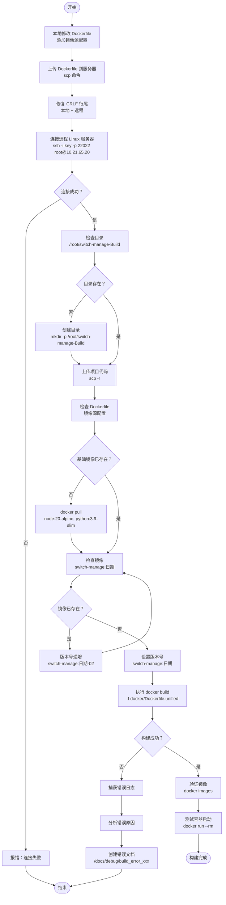

# Linux Build Switch Manage Skill

## Overview
This skill guides the process of building the Switch Manage project on a remote Linux server. The project is a **Python FastAPI + Vue3** full-stack application with unified Docker deployment.

**Project Architecture**:
- **Backend**: Python 3.9 + FastAPI + SQLAlchemy
- **Frontend**: Vue 3 + Vite + Element Plus
- **Database**: MariaDB 11
- **Deployment**: Unified Docker image with Nginx + Supervisor

## ⚠️ Critical: Build Requirements

### 1. Dockerfile Modifications (Required Before Build)

由于项目需要与主分支合并，Dockerfile 不能在仓库中永久修改。每次构建前需要在本地修改，然后上传到服务器。

**必须添加的修改**：

```dockerfile
# 在 docker/Dockerfile.unified 的前端构建阶段添加
FROM node:20-alpine AS frontend-build
ARG NPM_REGISTRY=https://registry.npmmirror.com  # 添加这一行
ENV NPM_REGISTRY=${NPM_REGISTRY}

# 在 Python 依赖安装阶段添加
FROM base AS python-deps
WORKDIR /unified-app/app
ARG PIP_INDEX_URL=https://pypi.tuna.tsinghua.edu.cn/simple  # 添加这一行
ENV PIP_INDEX_URL=${PIP_INDEX_URL}
```

**本地修改后上传到服务器**：
```powershell
# PowerShell: 上传修改后的 Dockerfile 到远程服务器
$SSH_KEY = "D:\BaiduSyncdisk\5.code\tools\ssh_key\ssh_key"
$DOCKERFILE = "d:\BaiduSyncdisk\5.code\netdevops\switch_manage\docker\Dockerfile.unified"
scp -i $SSH_KEY -P 22022 $DOCKERFILE root@10.21.65.20:/root/switch-manage-Build/docker/Dockerfile.unified
```

### 2. CRLF Line Endings Issue (Critical)

**Problem**: Scripts (especially `entrypoint.sh`) edited on Windows contain CRLF (`\r\n`) line endings, causing runtime errors:
```
/usr/bin/env: 'bash\r': No such file or directory
/usr/bin/env: use -[v]S to pass options in shebang lines
```

**Fix Steps**:

**Step 1: 本地 Windows 修复**
```powershell
# PowerShell: Convert CRLF to LF for all shell scripts
Get-ChildItem -Path "docker" -Filter "*.sh" | ForEach-Object { 
    $content = Get-Content $_.FullName -Raw
    $content = $content -replace "`r`n", "`n"
    Set-Content $_.FullName -Value $content -NoNewline
    Write-Host "Fixed: $($_.FullName)" 
}
```

**Step 2: 上传到远程服务器后再次修复**
```bash
# SSH 到远程服务器后执行
sed -i 's/\r$//' /root/switch-manage-Build/docker/entrypoint.sh

# 验证修复结果
file /root/switch-manage-Build/docker/entrypoint.sh
# 应该显示："/usr/bin/env bash script, ASCII text executable"
# 不应该显示："with CRLF line terminators"
```

### 3. Network Proxy Configuration (大陆环境必需)

**Problem**: npm and pip default registries are slow or inaccessible in mainland China

**Solution**: Use Chinese mirrors

```bash
# Frontend: Use npmmirror
npm config set registry https://registry.npmmirror.com

# Backend: Use Tsinghua PyPI mirror
pip install -r requirements.txt -i https://pypi.tuna.tsinghua.edu.cn/simple
```

## Build Process Flowchart



## Core Build Process

### Step 1: 本地准备（Windows）

**1.1 修改 Dockerfile**
在本地项目中修改 `docker/Dockerfile.unified`，添加镜像源配置：

```dockerfile
# 在前端构建阶段添加
FROM node:20-alpine AS frontend-build
ARG NPM_REGISTRY=https://registry.npmmirror.com
ENV NPM_REGISTRY=${NPM_REGISTRY}
WORKDIR /build/frontend
COPY frontend/package*.json ./
RUN npm install --registry=${NPM_REGISTRY}

# 在 Python 依赖安装阶段添加
FROM base AS python-deps
WORKDIR /unified-app/app
ARG PIP_INDEX_URL=https://pypi.tuna.tsinghua.edu.cn/simple
ENV PIP_INDEX_URL=${PIP_INDEX_URL}
COPY requirements.txt .
RUN pip install --no-cache-dir -r requirements.txt -i ${PIP_INDEX_URL}
```

**1.2 修复所有 shell 脚本的 CRLF**
```powershell
Get-ChildItem -Path "docker" -Filter "*.sh" | ForEach-Object { 
    $content = Get-Content $_.FullName -Raw
    $content = $content -replace "`r`n", "`n"
    Set-Content $_.FullName -Value $content -NoNewline
}
```

### Step 2: 上传到远程服务器

**2.1 上传项目代码**
```powershell
$SSH_KEY = "D:\BaiduSyncdisk\5.code\tools\ssh_key\ssh_key"
$PROJECT_DIR = "d:\BaiduSyncdisk\5.code\netdevops\switch_manage"

# 上传整个项目（排除不必要的文件）
scp -i $SSH_KEY -P 22022 -r $PROJECT_DIR root@10.21.65.20:/root/switch-manage-Build/
```

**2.2 上传修改后的 Dockerfile**
```powershell
$DOCKERFILE = "d:\BaiduSyncdisk\5.code\netdevops\switch_manage\docker\Dockerfile.unified"
scp -i $SSH_KEY -P 22022 $DOCKERFILE root@10.21.65.20:/root/switch-manage-Build/docker/Dockerfile.unified
```

**2.3 上传 entrypoint.sh**
```powershell
$ENTRYPOINT = "d:\BaiduSyncdisk\5.code\netdevops\switch_manage\docker\entrypoint.sh"
scp -i $SSH_KEY -P 22022 $ENTRYPOINT root@10.21.65.20:/root/switch-manage-Build/docker/entrypoint.sh
```

### Step 3: 远程服务器准备

**3.1 连接服务器**
```powershell
ssh -i "D:\BaiduSyncdisk\5.code\tools\ssh_key\ssh_key" -p 22022 root@10.21.65.20
```

**3.2 再次修复 CRLF（确保）**
```bash
cd /root/switch-manage-Build
sed -i 's/\r$//' docker/entrypoint.sh
file docker/entrypoint.sh  # 验证
```

**3.3 检查基础镜像**
```bash
docker images | grep -E "node|python|mariadb"
# 如果不存在，下载所需镜像
docker pull node:20-alpine
docker pull python:3.9-slim-bookworm
docker pull mariadb:11
```

### Step 4: 执行 Docker 构建

**4.1 确定版本号**
```bash
VERSION=$(date +%Y%m%d)
docker images | grep switch-manage | grep $VERSION
# 如果已存在，使用 ${VERSION}-02, ${VERSION}-03 等
```

**4.2 构建镜像**
```bash
cd /root/switch-manage-Build
VERSION=$(date +%Y%m%d)
docker build \
  -f docker/Dockerfile.unified \
  --build-arg NPM_REGISTRY=https://registry.npmmirror.com \
  --build-arg PIP_INDEX_URL=https://pypi.tuna.tsinghua.edu.cn/simple \
  -t switch-manage:$VERSION .
```

### Step 5: 验证构建结果

**5.1 检查镜像**
```bash
docker images | grep switch-manage
```

**5.2 测试容器启动**
```bash
# 测试是否能正常启动（不映射端口，仅验证）
VERSION=$(date +%Y%m%d)
docker run --rm switch-manage:$VERSION

# 应该看到启动日志，没有 bash 错误
```

**5.3 验证 entrypoint 脚本**
```bash
VERSION=$(date +%Y%m%d)
docker run --rm --entrypoint /bin/bash switch-manage:$VERSION -c "head -3 /entrypoint.sh | od -c"
# 应该显示 \n 而不是 \r\n
```

**5.4 测试完整启动（带数据库）**
```bash
# 使用 docker-compose 测试完整环境
cd /root/switch-manage-Build
docker-compose -f docker-compose.unified.yml up -d

# 查看日志
docker logs -f switch_manage_unified

# 测试访问
curl http://localhost/health
```

## Common Mistakes

### 1. 忘记上传修改后的 Dockerfile

**Problem**: 使用服务器上的旧 Dockerfile，缺少镜像源配置

**Error**:
```
npm ERR! ETIMEDOUT
pip install timeouts
```

**Solution**: 每次构建前必须上传本地修改后的 Dockerfile

### 2. CRLF 修复不完整

**Problem**: 只在本地修复，上传到服务器后仍然是 CRLF

**Solution**: 本地修复 → 上传 → 远程再次修复 → 验证

### 3. 前端构建路径错误

**Problem**: Dockerfile 中前端路径配置错误

**Error**:
```
COPY frontend/ ./ : no such file or directory
```

**Solution**: 确保上传的项目结构正确，frontend/ 目录在根目录下

### 4. 版本号冲突

**Problem**: 镜像标签已存在，导致构建结果混乱

**Solution**: 构建前检查现有镜像，使用递增版本号
```bash
VERSION=$(date +%Y%m%d)
docker images | grep switch-manage | grep $VERSION
# 如果存在，使用 ${VERSION}-02, ${VERSION}-03 等
```

## Quick Reference

### 完整构建命令序列

```powershell
# ====== Windows 本地执行 ======

# 1. 修复 CRLF
Get-ChildItem -Path "docker" -Filter "*.sh" | ForEach-Object { 
    $content = Get-Content $_.FullName -Raw
    $content = $content -replace "`r`n", "`n"
    Set-Content $_.FullName -Value $content -NoNewline
}

# 2. 上传项目代码
$SSH_KEY = "D:\BaiduSyncdisk\5.code\tools\ssh_key\ssh_key"
$PROJECT_DIR = "d:\BaiduSyncdisk\5.code\netdevops\switch_manage"
scp -i $SSH_KEY -P 22022 -r $PROJECT_DIR root@10.21.65.20:/root/switch-manage-Build/

# 3. 上传修改后的 Dockerfile（如果本地已修改）
$DOCKERFILE = "docker\Dockerfile.unified"
scp -i $SSH_KEY -P 22022 $DOCKERFILE root@10.21.65.20:/root/switch-manage-Build/docker/Dockerfile.unified
```

```bash
# ====== SSH 到远程服务器后执行（推荐方式）======

# 方式 1：直接登录到远程服务器
ssh -i $SSH_KEY -p 22022 root@10.21.65.20

# 然后在远程服务器上依次执行：
cd /root/switch-manage-Build

# 修复 CRLF
sed -i 's/\r$//' docker/entrypoint.sh

# 检查基础镜像
docker images | grep -E "node|python"

# 确定版本号
VERSION=$(date +%Y%m%d)
docker images | grep switch-manage | grep $VERSION
# 如果已存在，使用 ${VERSION}-02

# 构建镜像
docker build \
  -f docker/Dockerfile.unified \
  --build-arg NPM_REGISTRY=https://registry.npmmirror.com \
  --build-arg PIP_INDEX_URL=https://pypi.tuna.tsinghua.edu.cn/simple \
  -t switch-manage:$VERSION .

# 验证
docker run --rm switch-manage:$VERSION
```

**或者使用单条 SSH 命令（简单场景）：**
```powershell
# 检查镜像（简单命令使用单引号）
ssh -i $SSH_KEY -p 22022 root@10.21.65.20 'docker images | grep switch-manage'

# 执行构建（复杂命令建议登录后执行，避免转义问题）
ssh -i $SSH_KEY -p 22022 root@10.21.65.20 'cd /root/switch-manage-Build && docker build -f docker/Dockerfile.unified -t switch-manage:$(date +%Y%m%d) .'
```

## PowerShell SSH 命令最佳实践

### 问题：PowerShell 中 SSH 命令转义复杂

PowerShell 和 Bash 的语法差异导致混合使用时容易出错，特别是：
- 变量扩展 `$VAR` vs `$Env:VAR`
- 引号处理 `"` vs `'`
- 特殊字符 `$`, `(`, `)` 等

### 解决方案

**方案 1：使用单引号包裹简单命令（推荐）**
```powershell
# ✅ 简单命令 - 使用单引号，避免 PowerShell 变量扩展
ssh -i $SSH_KEY -p 22022 root@10.21.65.20 'cd /root/switch-manage-Build && docker images | grep switch-manage'
```

**方案 2：使用 Here-String 复杂命令**
```powershell
# ✅ 复杂命令 - 使用 Here-String
$command = @'
cd /root/switch-manage-Build
VERSION=$(date +%Y%m%d)
docker images | grep switch-manage | grep $VERSION
'@
ssh -i $SSH_KEY -p 22022 root@10.21.65.20 $command
```

**方案 3：直接登录到远程服务器执行（最可靠）**
```powershell
# ✅ 最可靠的方式 - 登录后在远程 shell 中执行
ssh -i $SSH_KEY -p 22022 root@10.21.65.20
# 然后在远程服务器上执行所有命令
```

### 避免的写法

```powershell
# ❌ 双引号会导致 PowerShell 尝试扩展 $变量
ssh -i $SSH_KEY -p 22022 root@10.21.65.20 "cd /root/switch-manage-Build && VERSION=\$(date +%Y%m%d)"

# ❌ 反引号换行容易出错
ssh -i $SSH_KEY -p 22022 root@10.21.65.20 `
    "cd /root/switch-manage-Build && `
    docker build ..."
```

## Troubleshooting Checklist

- [ ] Dockerfile 已添加镜像源配置（NPM_REGISTRY, PIP_INDEX_URL）
- [ ] 修改后的 Dockerfile 已上传到服务器
- [ ] 所有 shell 脚本已修复 CRLF（本地 + 远程）
- [ ] 基础镜像已存在（node:20-alpine, python:3.9-slim）
- [ ] 版本号未冲突
- [ ] 使用 `--build-arg` 指定镜像源
- [ ] 构建成功无错误
- [ ] 容器能正常启动（无 bash 错误）
- [ ] entrypoint 脚本行尾正确
- [ ] 前端构建产物正确生成（dist/目录）
- [ ] 健康检查通过（/health 端点）

## Build Failure Documentation

### Error Analysis
- Capture complete build error output and logs.
- Identify source files contributing to failures.
- Analyze root cause (syntax, dependency, configuration).

### Documentation
- Create markdown documentation in `/docs/debug/build_error_$reason`.
- Include error messages, affected files, commands used, and environment details.

## Project-Specific Notes

### Switch Manage Project Structure
```
switch_manage/
├── app/                    # 后端代码
│   ├── api/               # API 路由
│   ├── models/            # 数据库模型
│   ├── schemas/           # Pydantic 模型
│   ├── services/          # 业务逻辑
│   ├── core/              # 核心配置
│   └── main.py            # 应用入口
├── frontend/              # 前端代码
│   ├── src/               # Vue 源代码
│   ├── public/            # 静态资源
│   └── package.json       # 依赖配置
├── docker/                # Docker 配置
│   ├── Dockerfile.unified # 统一镜像
│   ├── entrypoint.sh      # 启动脚本
│   ├── nginx.conf         # Nginx 配置
│   └── supervisord.conf   # 进程管理
├── scripts/               # 数据库脚本
├── requirements.txt       # Python 依赖
└── docker-compose.unified.yml
```

### Key Differences from One-API
- **Language**: Python + Vue (not Go + React)
- **Build Tool**: Vite (not Webpack)
- **Package Manager**: npm + pip (not npm + go mod)
- **Deployment**: Supervisor manages multiple processes (Nginx + Uvicorn)
- **Database**: MariaDB (not MySQL/SQLite)
