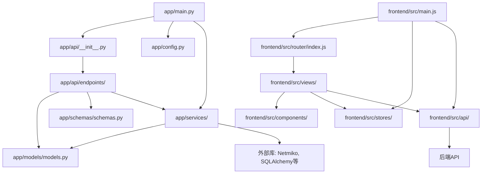
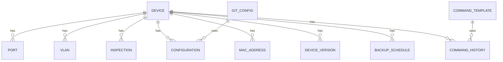
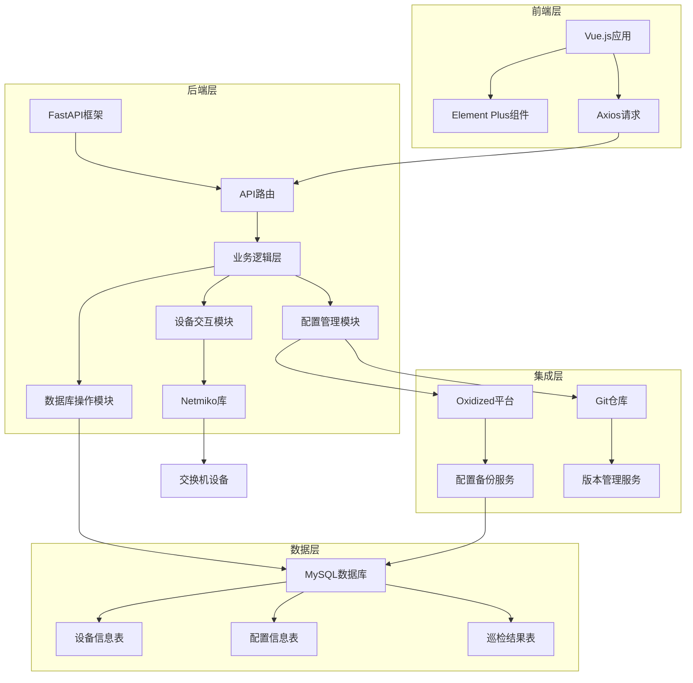
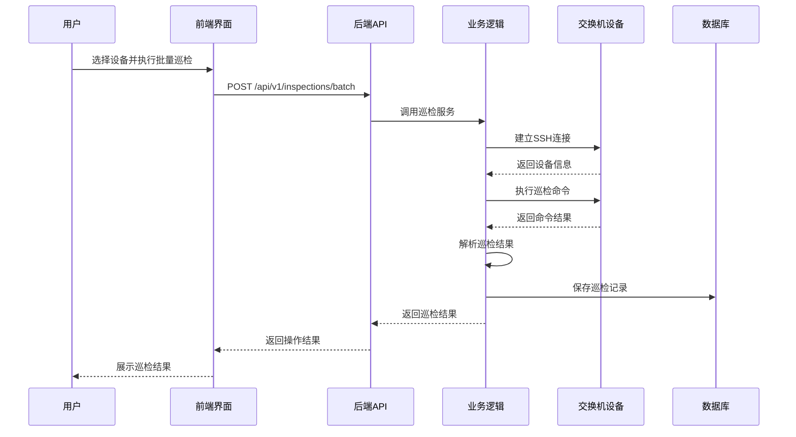
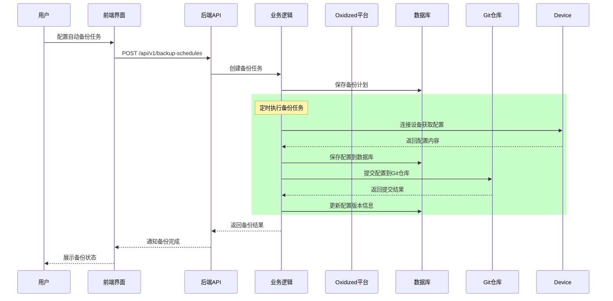

# 交换机批量管理与巡检系统 - 项目分析报告

## 1. 项目概述

### 1.1 项目背景
本项目是一个用于批量管理和巡检交换机的Web应用，旨在简化网络设备的管理流程，提高网络运维效率。系统支持批量配置交换机基本信息、端口信息、VLAN信息等，同时提供批量巡检功能，实时获取交换机的运行状态和性能指标。

### 1.2 核心目标
- 简化网络设备管理流程
- 提高网络运维效率
- 实现批量操作，减少重复劳动
- 实时监控设备状态，及时发现问题
- 与现有系统（如Oxidized）集成，实现数据共享

## 2. 技术栈分析

### 2.1 后端技术栈
| 技术/框架 | 版本 | 用途 | 优势 |
|----------|------|------|------|
| Python | 3.8+ | 开发语言 | 简洁、易读、丰富的库支持 |
| FastAPI | 0.104.1 | Web框架 | 高性能、异步支持、自动生成API文档 |
| SQLAlchemy | 2.0.23 | ORM框架 | 强大的数据库抽象、支持多种数据库 |
| Netmiko | 4.1.0 | 网络设备连接 | 支持多种网络设备厂商、简化SSH连接 |
| Pydantic | 2.5.0 | 数据验证 | 强大的数据验证、类型提示支持 |
| python-dotenv | 1.0.0 | 环境变量管理 | 简化配置管理、支持不同环境配置 |

### 2.2 前端技术栈
| 技术/框架 | 版本 | 用途 | 优势 |
|----------|------|------|------|
| Vue.js | 3.5.24 | 前端框架 | 响应式设计、组件化开发、性能优良 |
| Element Plus | 2.13.1 | UI组件库 | 丰富的组件、美观的设计、良好的文档 |
| Axios | 1.13.2 | HTTP客户端 | 简洁的API、支持拦截器、并发请求 |
| Vue Router | 4.6.4 | 路由管理 | 灵活的路由配置、支持嵌套路由 |
| Pinia | 3.0.4 | 状态管理 | 简洁的API、TypeScript支持、模块化设计 |
| highlight.js | 11.11.1 | 代码高亮 | 支持多种语言、易于集成 |

### 2.3 数据库与中间件
| 技术 | 版本 | 用途 | 优势 |
|------|------|------|------|
| MySQL | 5.7+ | 数据库 | 稳定可靠、广泛使用、支持事务 |
| Oxidized | 0.28+ | 配置备份 | 自动备份设备配置、版本管理 |
| Docker | - | 容器化部署 | 简化部署、环境一致性、易于扩展 |

## 3. 项目结构分析

### 3.1 目录结构
```
switch_manage/
├── app/                    # 后端应用代码
│   ├── api/                # API路由定义
│   │   └── endpoints/      # 具体API端点实现
│   ├── models/             # 数据模型定义
│   ├── schemas/            # 数据验证模型
│   ├── services/           # 业务逻辑实现
│   ├── config.py           # 配置文件
│   ├── db_update.py        # 数据库更新脚本
│   └── main.py             # 应用入口
├── data/                   # 数据文件目录
├── frontend/               # 前端应用代码
│   ├── public/             # 静态资源
│   ├── src/                # 源代码
│   │   ├── api/            # API调用封装
│   │   ├── assets/         # 静态资源
│   │   ├── components/     # Vue组件
│   │   ├── router/         # 路由配置
│   │   ├── stores/         # 状态管理
│   │   ├── views/          # 页面组件
│   │   ├── App.vue         # 根组件
│   │   └── main.js         # 前端入口
│   └── test/               # 前端测试代码
├── scripts/                # 辅助脚本
├── tests/                  # 后端测试代码
├── .env.example            # 环境变量示例
├── .gitignore              # Git忽略文件
├── Dockerfile              # Docker构建文件
├── README.md               # 项目说明文档
├── docker-compose.yml      # Docker Compose配置
├── pytest.ini              # pytest配置
├── requirements.txt        # 后端依赖
├── 需求描述.md              # 需求文档
└── 项目文档.md              # 项目文档
```

### 3.2 模块依赖关系



## 4. 核心功能模块

### 4.1 设备管理模块
- **功能描述**：管理交换机基本信息，包括主机名、IP地址、厂商、型号等
- **主要操作**：
  - 设备信息的增删改查
  - 设备分组管理
  - 批量导入/导出设备信息
  - 设备状态监控
- **API路径**：`/api/v1/devices`
- **相关文件**：
  - 后端：`app/api/endpoints/devices.py`
  - 前端：`frontend/src/views/DeviceManagement.vue`

### 4.2 端口管理模块
- **功能描述**：管理交换机端口信息，包括状态、速率、描述等
- **主要操作**：
  - 端口信息的查询和更新
  - 批量配置端口描述
  - 端口状态监控
- **API路径**：`/api/v1/ports`
- **相关文件**：
  - 后端：`app/api/endpoints/ports.py`
  - 前端：`frontend/src/views/PortManagement.vue`

### 4.3 VLAN管理模块
- **功能描述**：管理交换机VLAN信息
- **主要操作**：
  - VLAN信息的增删改查
  - 批量配置VLAN
- **API路径**：`/api/v1/vlans`
- **相关文件**：
  - 后端：`app/api/endpoints/vlans.py`
  - 前端：`frontend/src/views/VLANManagement.vue`

### 4.4 巡检管理模块
- **功能描述**：批量巡检交换机，获取运行状态和性能指标
- **主要操作**：
  - 创建和执行巡检任务
  - 采集设备性能指标（CPU、内存使用率等）
  - 检查端口状态
  - 生成巡检报告
- **API路径**：`/api/v1/inspections`
- **相关文件**：
  - 后端：`app/api/endpoints/inspections.py`
  - 前端：`frontend/src/views/InspectionManagement.vue`

### 4.5 配置管理模块
- **功能描述**：管理交换机配置信息
- **主要操作**：
  - 查看设备配置
  - 配置版本管理
  - 与Oxidized集成获取配置备份
- **API路径**：`/api/v1/configurations`
- **相关文件**：
  - 后端：`app/api/endpoints/configurations.py`
  - 前端：`frontend/src/views/ConfigurationManagement.vue`

### 4.6 设备分组模块
- **功能描述**：对设备进行分组管理
- **主要操作**：
  - 创建和管理设备分组
  - 将设备分配到不同分组
  - 对分组设备进行批量操作
- **API路径**：`/api/v1/device-collection`
- **相关文件**：
  - 后端：`app/api/endpoints/device_collection.py`
  - 前端：`frontend/src/views/DeviceCollection.vue`

### 4.7 Git配置模块
- **功能描述**：管理Git仓库配置，用于配置版本管理
- **主要操作**：
  - Git仓库信息的增删改查
  - 配置自动备份到Git
- **API路径**：`/api/v1/git-configs`
- **相关文件**：
  - 后端：`app/api/endpoints/git_configs.py`
  - 前端：`frontend/src/views/GitConfigManagement.vue`

### 4.8 命令模板与历史模块
- **功能描述**：管理命令模板和执行历史
- **主要操作**：
  - 创建和管理命令模板
  - 执行命令并记录历史
  - 查看命令执行结果
- **API路径**：
  - 命令模板：`/api/v1/command-templates`
  - 执行历史：`/api/v1/command-history`
- **相关文件**：
  - 后端：`app/api/endpoints/command_templates.py`、`app/api/endpoints/command_history.py`

## 5. 数据库设计

### 5.1 数据模型关系



### 5.2 核心数据模型

#### 5.2.1 设备表 (devices)
| 字段名 | 数据类型 | 描述 |
|--------|----------|------|
| id | Integer | 主键ID |
| hostname | String | 设备主机名 |
| ip_address | String | IP地址 |
| vendor | String | 设备厂商 |
| model | String | 设备型号 |
| os_version | String | 操作系统版本 |
| location | String | 设备位置 |
| contact | String | 联系人 |
| status | String | 设备状态 |
| login_method | String | 登录方式 |
| login_port | Integer | 登录端口 |
| username | String | 用户名 |
| password | String | 密码 |
| sn | String | 设备序列号 |
| created_at | DateTime | 创建时间 |
| updated_at | DateTime | 更新时间 |

#### 5.2.2 端口表 (ports)
| 字段名 | 数据类型 | 描述 |
|--------|----------|------|
| id | Integer | 主键ID |
| device_id | Integer | 设备ID（外键） |
| port_name | String | 端口名称 |
| status | String | 端口状态 |
| speed | String | 端口速率 |
| description | Text | 端口描述 |
| vlan_id | Integer | VLAN ID |
| created_at | DateTime | 创建时间 |
| updated_at | DateTime | 更新时间 |

#### 5.2.3 巡检结果表 (inspections)
| 字段名 | 数据类型 | 描述 |
|--------|----------|------|
| id | Integer | 主键ID |
| device_id | Integer | 设备ID（外键） |
| inspection_time | DateTime | 巡检时间 |
| cpu_usage | Float | CPU使用率 |
| memory_usage | Float | 内存使用率 |
| interface_status | JSON | 接口状态 |
| error_logs | Text | 错误日志 |
| status | String | 巡检状态 |
| created_at | DateTime | 创建时间 |

#### 5.2.4 配置信息表 (configurations)
| 字段名 | 数据类型 | 描述 |
|--------|----------|------|
| id | Integer | 主键ID |
| device_id | Integer | 设备ID（外键） |
| config_content | Text | 配置内容 |
| config_time | DateTime | 配置时间 |
| version | String | 配置版本 |
| change_description | Text | 变更描述 |
| git_commit_id | String | Git提交ID |
| created_at | DateTime | 创建时间 |

## 6. API接口设计

### 6.1 API路由结构
```
/api/v1/
├── devices/                # 设备管理
├── ports/                  # 端口管理
├── vlans/                  # VLAN管理
├── inspections/            # 巡检管理
├── configurations/         # 配置管理
├── device-collection/      # 设备分组管理
├── git-configs/            # Git配置管理
├── command-templates/      # 命令模板管理
└── command-history/        # 命令执行历史
```

### 6.2 典型API端点示例

#### 6.2.1 设备管理
- `GET /api/v1/devices` - 获取设备列表
- `POST /api/v1/devices` - 创建新设备
- `GET /api/v1/devices/{id}` - 获取设备详情
- `PUT /api/v1/devices/{id}` - 更新设备信息
- `DELETE /api/v1/devices/{id}` - 删除设备
- `POST /api/v1/devices/batch` - 批量操作设备

#### 6.2.2 巡检管理
- `POST /api/v1/inspections` - 执行巡检
- `GET /api/v1/inspections` - 获取巡检记录
- `GET /api/v1/inspections/{id}` - 获取巡检详情
- `POST /api/v1/inspections/batch` - 批量巡检

### 6.3 API设计原则
1. **RESTful设计**：使用HTTP方法表示操作类型
2. **清晰的资源命名**：使用名词表示资源
3. **版本化API**：通过URL前缀管理API版本
4. **统一的响应格式**：包含状态码、消息和数据
5. **完善的错误处理**：返回详细的错误信息
6. **自动生成文档**：使用FastAPI自动生成OpenAPI文档

## 7. 系统架构

### 7.1 整体架构



### 7.2 核心业务流程

#### 7.2.1 设备批量巡检流程



#### 7.2.2 配置备份流程



## 8. 开发流程

### 8.1 后端开发流程
1. **API设计**：定义API端点和数据模型
2. **数据模型开发**：在`app/models/`目录下定义数据库模型
3. **数据验证模型开发**：在`app/schemas/`目录下定义Pydantic模型
4. **业务逻辑开发**：在`app/services/`目录下实现业务逻辑
5. **API端点开发**：在`app/api/endpoints/`目录下实现API端点
6. **单元测试**：在`tests/unit/`目录下编写单元测试
7. **集成测试**：在`tests/integration/`目录下编写集成测试

### 8.2 前端开发流程
1. **页面设计**：设计页面布局和交互
2. **组件开发**：开发可复用的Vue组件
3. **页面开发**：开发具体的页面组件
4. **API调用封装**：封装后端API调用
5. **状态管理**：使用Pinia管理应用状态
6. **路由配置**：配置页面路由
7. **测试**：编写前端测试用例

### 8.3 代码质量保障
1. **代码风格**：使用Prettier格式化代码
2. **类型检查**：使用TypeScript（前端）和Python类型提示
3. **测试覆盖率**：确保关键功能有足够的测试覆盖率
4. **代码审查**：进行代码审查，确保代码质量

## 9. 部署方案

### 9.1 本地开发环境
```bash
# 后端启动
uvicorn app.main:app --host 0.0.0.0 --port 8000 --reload

# 前端启动
cd frontend
npm run dev
```

### 9.2 Docker部署
```bash
# 使用Docker Compose部署
docker-compose up -d
```

### 9.3 环境配置
- **开发环境**：使用`.env`文件配置开发环境变量
- **生产环境**：使用环境变量或配置中心管理生产环境配置

## 10. 测试策略

### 10.1 测试类型
1. **单元测试**：测试单个函数或方法
2. **集成测试**：测试模块之间的交互
3. **API测试**：测试API端点的功能和性能
4. **前端测试**：测试前端组件和页面

### 10.2 测试工具
- **后端测试**：pytest
- **前端测试**：vitest
- **API测试**：FastAPI自带的测试客户端

### 10.3 测试执行
```bash
# 后端单元测试
python -m pytest tests/unit/

# 后端集成测试
python -m pytest tests/integration/

# 前端测试
cd frontend
npm run test
```

## 11. 项目优势与改进建议

### 11.1 项目优势
1. **技术栈先进**：使用FastAPI、Vue 3等现代化技术
2. **模块化设计**：代码结构清晰，易于维护和扩展
3. **功能全面**：涵盖设备管理、巡检、配置管理等核心功能
4. **良好的扩展性**：支持与Oxidized、Git等系统集成
5. **自动化程度高**：支持批量操作和定时任务

### 11.2 改进建议
1. **添加用户认证和授权**：目前缺少用户认证机制
2. **增强日志管理**：添加更完善的日志记录和分析
3. **添加监控告警功能**：实现基于阈值的告警
4. **优化前端性能**：对大型设备列表进行分页和懒加载
5. **增强测试覆盖率**：增加更多的单元测试和集成测试
6. **添加API文档的中文支持**：目前文档为英文
7. **实现配置差异对比**：支持不同版本配置的差异对比

## 12. 总结

本项目是一个功能全面、技术先进的交换机批量管理与巡检系统，采用了现代化的技术栈和架构设计。系统具有良好的扩展性和可维护性，能够满足网络运维人员的核心需求。通过进一步完善用户认证、日志管理和监控告警等功能，可以使系统更加成熟和稳定，为网络运维工作提供更大的支持。

该项目的设计和实现遵循了最佳实践，具有清晰的模块化结构和良好的代码组织，为后续的功能扩展和维护奠定了坚实的基础。